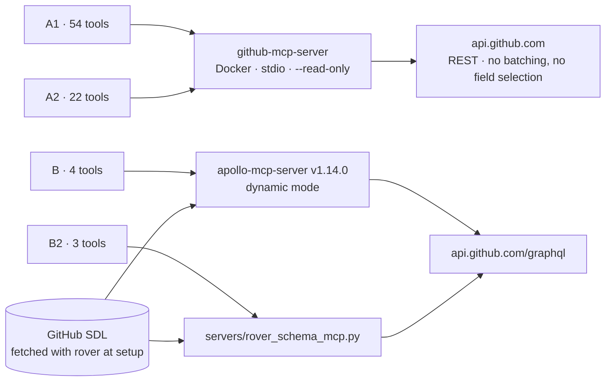
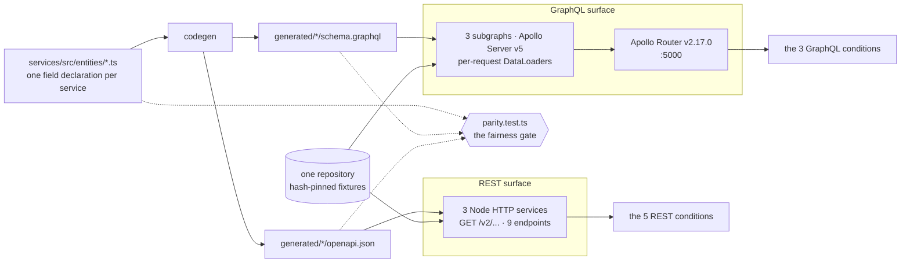
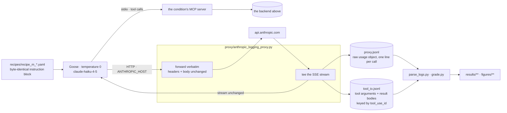
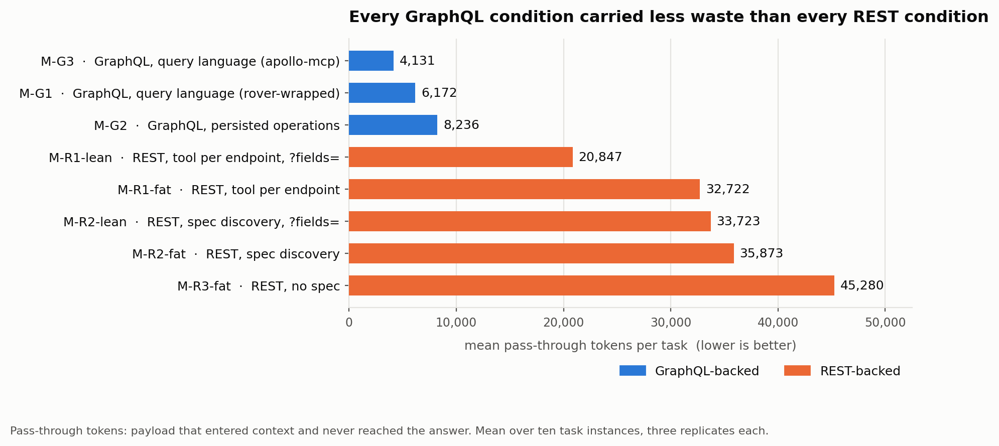
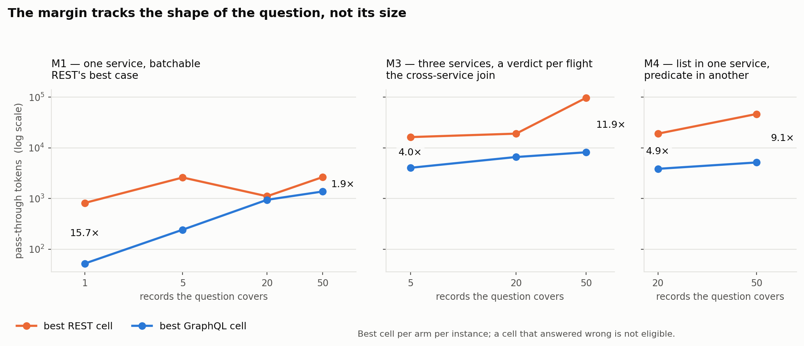

# GraphQL-backed MCP tools are more token-efficient

This benchmark suite evaluates a variety of agentic tasks run against multiple different setups, some backed by a GraphQL API and some backed by a REST API.  GraphQL-over-MCP tool calls achieve task success using fewer tokens than REST-over-MCP and with lower overall inference costs.  I am comparing apples-to-apples: even REST API variants implemented with OpenAPI schema and field selection capabilities do not match GraphQL’s token efficiency.  The results favor GraphQL for both trivial tasks that query a real production system (GitHub) and tasks that require fetching from multiple services/entities (a mocked travel-booking API, the GraphQL variant of which uses Federation for orchestration). Three mechanisms drive that gap: field selection is the default grammar of a GraphQL query rather than an opt-in bracket a REST client has to remember to add; the schema's type language lets a model compose a correct query from training-time knowledge instead of a discovery-then-dispatch chain; and the same join operation costs differently depending on who performs it — expensive and brittle in the agent's inference loop, cheap and deterministic in the router.

I ran two experiments. Phase 1 pointed MCP servers at GitHub's live API and asked the same
question through each — 24 runs, $0.53. Phase 2 built a synthetic three-service airline
backend, generated a REST surface and a federated GraphQL surface from a single field
definition, and swept four questions over how many records they cover — 240 runs, $51.16.
Everything ran on `claude-haiku-4-5` at temperature 0, through Goose, behind a logging reverse
proxy that recorded the raw Anthropic `usage` object for every model call.

*The per-cell tables, the mechanism, the scored pre-registration
and the caveats in full are in [`FINDINGS.md`](FINDINGS.md); the generated reports are in
[`results/`](results); how to run any of it is in [`README.md`](README.md).*

---

## What ran

### Phase 1 — GitHub's live API

Four conditions, two tasks, three replicates each. The narrow question: on a real API that ships
both a REST interface and a GraphQL interface, what does the same request cost through each?

| cell | protocol | packaging | server | tools |
|---|---|---|---|--:|
| `A1` | REST | every toolset the server ships | `github-mcp-server`, Docker, `--read-only` | 54 |
| `A2` | REST | `--toolsets repos,issues,pull_requests` | same binary | 22 |
| `B` | GraphQL | schema discovery then execute | `apollo-mcp-server` v1.14.0, dynamic | 4 |
| `B2` | GraphQL | schema discovery then execute | `servers/rover_schema_mcp.py` | 3 |



The two REST conditions differ only in how much of it is switched on. The two
GraphQL conditions are similar as well, one uses an open-source GraphQL MCP server and another uses
a thin wrapper over an existing schema search and description utility; both hand the agent a
query language rather than pre-built operations. `T1` asks for five pull
requests and their changed files, which is the N+1 case; `T2` asks for one, and is a
single-entity control that carries no protocol claim.

Phase 1's strength is that nothing about it is synthetic. Its limit is that it's measuring both
the protocol and the implementation details of GitHub's production services.
Phase 2 fills this gap.

### Phase 2 — a contrived backend

Eight condition cells, reported as eight rows and never averaged together. Each is one MCP server
pointed at one of two surfaces over the same three services.

| cell | protocol | packaging | server | tools |
|---|---|---|---|--:|
| `M-R1-fat` | REST | one tool per endpoint, full payloads | `openapi_mcp.py --mode tools` | 9 |
| `M-R1-lean` | REST | same, honoring `?fields=` | `openapi_mcp.py --mode tools` | 9 |
| `M-R2-fat` | REST | generic tools over the OpenAPI spec | `openapi_mcp.py --mode discovery` | 3 |
| `M-R2-lean` | REST | same, honoring `?fields=` | `openapi_mcp.py --mode discovery` | 3 |
| `M-R3-fat` | REST | one generic HTTP tool, no spec at all | `openapi_mcp.py --mode bare` | 1 |
| `M-G1` | GraphQL | schema discovery then execute | `supergraph_mcp.py` | 3 |
| `M-G2` | GraphQL | persisted operations, one tool each | `apollo-mcp-server` v1.14.0 | 7 |
| `M-G3` | GraphQL | schema discovery then execute | `apollo-mcp-server` v1.14.0, dynamic | 3 |

The server column is what makes the axes separable. `M-R1`, `M-R2` and `M-R3` are one file in
three modes, so the REST axis varies packaging and nothing else; `M-G2` and `M-G3` are one binary
in two modes, so the GraphQL axis does too. `M-G3` closes the square — same implementation as
`M-G2` with different packaging, same packaging as `M-G1` with a different implementation. `M-G1`
is a control I wrote, not a product anyone can install, and it is reported alongside the
shipping equivalent rather than in place of it.

Three services: flight scheduling, fleet maintenance, crew personnel. Each are modeled after an airline
operations stack because it gives a natural three-way join: a flight is scheduled by one
service, flown by an aircraft owned by another, and crewed by people belonging to a third. Both
surfaces are generated from one field declaration and read the same records through the same
repository, so the implementation won't have hidden bias toward either protocol.



`parity.test.ts` is the fairness gate, and it enforces that every canonical field must be reachable
on both REST and GraphQL, and REST may carry extra keys only when they are declared redundant and
derived from a
canonical field. Extra bytes are permitted but not extra information since that's the whole point; the
extra bytes are what the study measures.

REST was the steelman. I gave it an OpenAPI document generated from the implementation so it
can never be stale or partial. It contains nine endpoints across three services with one naming convention,
one envelope and one pagination scheme; batch-by-id on every collection; and a `?fields=`
sparse-fieldset bracket. This is an extremely generous setup IMO. Payloads are deliberately bloated
in ways that production APIs typically
are. This includes envelope wrappers, code/label twins, and denormalized nested objects. A flight comes back
with 46 fields under the `fat` profile. Cross-service expansion is the one thing REST is not
allowed: a service may link to another service's resource but never inline it, because that is
precisely the constraint that GraphQL Federation exists to solve.

### The phase-2 tasks

Four questions, swept over how many records they cover: M1 one service and batchable
(REST's best case), M2 one record across three services, M3 M2 swept over *N*, M4 the
list in one service and the predicate in another. All ten instances are quoted verbatim in
[`tasks/tasks.yaml`](tasks/tasks.yaml), which is the only place the wording lives. M3, the
cross-service join, reads:

```
For each of these flights — {{ids}} — determine whether every assigned
pilot (the captain and the first officer) holds a type rating for that
flight's aircraft model which is still current as of {{as_of}}. Report one
line per flight: the flight id, then yes or no. Cover all {{n}} flights.
```

### How a run was measured

Nothing is read out of the agent's own logs. Goose points at a logging reverse proxy that
forwards every model call verbatim and tees the response stream, so the numbers are the raw
`usage` object the API returned rather than a harness's re-reporting of it.



The proxy is deliberately naive: it records what crossed the wire and decides nothing, because it
is the one component whose correctness underpins every published number. The sidecar exists
because the headline metric needs to know both the size and content of a payload.

That metric is "pass-through tokens:" payload that entered the agent's context and whose values
never appear in its answer. Put another way, it's the data the agent carried, paid for
on every subsequent call, and didn't use. In other words: waste. All five phase-2 recipes carry a byte-identical
instruction block that names no tool and suggests no strategy, and the runner refuses to start if
they drift.

---

## The result

GraphQL-over-MCP outperforms REST-over-MCP across all tasks.



All three GraphQL conditions place above all five REST conditions. The worst GraphQL condition carries
2.5× less than the best REST condition.

Best GraphQL cell against best REST cell, instance by instance:

| task | best REST | best GraphQL | cost ratio | token ratio |
|---|--:|--:|--:|--:|
| M1 @ 1 | $0.0081 | $0.0046 | 1.76× | 15.71× |
| M1 @ 5 | $0.0145 | $0.0058 | 2.50× | 10.73× |
| M1 @ 20 | $0.0159 | $0.0111 | 1.43× | 1.18× |
| M1 @ 50 | $0.0251 | $0.0202 | 1.24× | 1.93× |
| M2 @ 1 | $0.0221 | $0.0068 | 3.25× | 3.55× |
| M3 @ 5 | $0.0858 | $0.0193 | 4.45× | 4.04× |
| M3 @ 20 | $0.2214 | $0.0480 | 4.61× | 2.89× |
| M3 @ 50 | $0.4765 | $0.0677 | 7.04× | 11.88× |
| M4 @ 20 | $0.0733 | $0.0233 | 3.15× | 4.95× |
| M4 @ 50 | $0.1287 | $0.0388 | 3.32× | 9.06× |

Median cell: 3.19× on cost, 4.49× on tokens. Ten out of ten.

There is no single multiple here, and the margin is not monotone in N. It collapses as the
batchable single-service question grows and widens on the cross-service joins:



Two qualifications. GraphQL did not win on round-trips: the best REST configuration
made the same number of tool calls or fewer on five of the ten instances. And no single
GraphQL condition wins everywhere: `M-G2` and `M-G3` take five token cells each.

Accuracy is mostly not where the difference lives. 178 of 239 graded runs scored a perfect
f1 and 53 of 80 condition/task cells were perfect outright. The widest gap is `M1@1` —
GraphQL 1.00 against REST 0.80 — and it is entirely `M-R3` failing three times out of three on
the simplest question in the matrix, which is the second result below.

### Phase 1, on the live API

`T1` — five pull requests and their changed files — is the same class of question as `M3`, asked
of an API nobody in this study controls:

| condition | tool calls | tool-result tokens | prefix tokens | cost/run | wall |
|---|--:|--:|--:|--:|--:|
| `A1` — GitHub MCP, 54 tools | 10 | 26,970 | 18,471 | $0.0713 | 22.3 s |
| `A2` — GitHub MCP, 22 tools | 10 | 26,970 | 8,860 | $0.0636 | 20.6 s |
| `B` — Apollo MCP Server | 1 | 419 | 1,609 | $0.0089 | 10.6 s |
| `B2` — Rover Schema MCP | 1 | 419 | 1,656 | $0.0090 | 10.6 s |

64× the payload for the same five pull requests, at 7.9× the cost. REST made ten calls and
GraphQL made one, exactly as the N+1 shape predicts: five results, then five more, every one of
them staying in context for the rest of the conversation. The two GraphQL conditions are
indistinguishable from each other on both tasks, which is worth noting on its own: a four-tool
surface and a three-tool surface produced the same call counts and costs within a cent.

Phase 1 cannot separate protocol from implementation, which is why phase 2 exists, and its prompts
were not symmetric. The GraphQL recipes carried a batching hint that REST got no equivalent of.
Both asymmetries cut in GraphQL's favor and phase 2 tested a service with no such gap.

### Stages of inference

While analyzing Phase 1, I asked an agent to review the inference logs and categorize the model's
output, then generalized that into a taxonomy that differentiates the function of each inference
call. My taxonomy is below:

1. **Initialization** writes the tool schema to the prefix cache and scales with toolset size alone,
before a single task-specific decision gets made. You can see the phase-1 results in the above
table: 18,471 tokens for 54 tools against 1,609–1,656 tokens for 3–4 tools. GraphQL compares
favorably here too, simply by exposing a sparse tool set by default.
2. **Orchestration** is an inference call whose parameters are already fully determined by information
already in context. This could include a task prompt handing over a fixed list (phase 1's PR sweep)
or one service's response supplying the ID needed to call the next, the "waterfall" pattern
familiar from front-end data-fetching. Either way, no language-model judgment is required: a
deterministic scheduler with the same inputs would make the same call. Orchestration is low-value
inference: you're paying a lot for work a `for` loop could do for free. Orchestration calls are
overrepresented in the REST conditions throughout this suite. The GraphQL conditions largely avoid
it by composing a query and letting the router or federation layer perform the equivalent join
outside the model's control flow entirely.
3. **Reasoning** is the type of inference call that concerns itself with decision-making and judgment.
It is the highest-value type of inference because it leverages the "sweet spot" of language models:
predicting next steps based on context. Reasoning output determines which tools to call, what the
next logical step toward task completion is, and when user input is needed. For GraphQL workloads,
Reasoning-type inference is used to compose queries. REST could show an analogous reasoning step
where a surface hands the model a spec to search rather than a fixed toolset. Phase 1 has no such
surface, so its REST conditions show zero reasoning calls; phase 2's discovery-mode REST conditions
are the more likely place to find one, and classifying those transcripts the same way is a natural
next pass, not yet done.
4. **Synthesis** is the last inference call in a task: it is when all the accumulated context is
summarized and the reply to the user is sent. Like Initialization, there are limited ways to control
costs at this stage. There is no functional difference in Synthesis calls between REST and GraphQL
workloads.

This breakdown is drawn from phase 1's transcripts only. The verbatim quotes, classified call by
call, are in [`results/phase1/quotes.md`](results/phase1/quotes.md).

## Limits

Four, stated in full with their evidence in [`FINDINGS.md` §Caveats](FINDINGS.md).

1. The dollar figures are inflated due to lack of caching. Phase 2 read zero cached
   tokens back across all 241 runs. Every prefix sits under `claude-haiku-4-5`'s 4,096-token
   minimum cacheable prefix. So every call bills a cache write at 1.25× and reads nothing back.
   That penalizes whichever condition makes the most calls, which here is a *GraphQL* one. In
   phase 1 the effect runs the other way and the 7.9× is understated. Quote the direction of
   the cost figures, not their magnitude; the token counts are unaffected.
2. Averages misbehave on a matrix swept over N. `M3@50` alone is 46.6% of the lean-REST
   pass-through numerator. Read the per-cell tables, not a summary multiple.
3. The tokens are counted with the wrong tokenizer, in a known direction. `cl100k_base` is
   OpenAI's encoding; cross-checked against the API's own `usage` it runs 14–22% low. Every
   pass-through figure here is a same-signed underestimate.
4. One model, one harness, one backend. Follow-up work may want to test more combinations.

## Conclusion

On a contrived backend, the best GraphQL-backed MCP server beat the best REST-backed one on
all ten task instances, on wasted tokens and on cost per task, by a median of 4.5× and 3.2×. On
GitHub's live API the same shape appears at 64× the payload. And REST was
the steelman: a small, orderly, perfectly-documented three-service backend is the best case I
could have handed it, and it lost every instance.

GraphQL's advantage comes from three features the language enables:

1. Field selection
2. Schema language semantics
3. API orchestration

## Disclosure

This work was done by an employee of Apollo GraphQL, which sells GraphQL tooling, and it lives
in an Apollo-owned repository. Three of the conditions run Apollo software: phase-1 condition `B`
and phase-2 `M-G2` and `M-G3` use `apollo-mcp-server` v1.14.0, and the phase-2 GraphQL backend is
Apollo Router v2.17.0 over Apollo Server v5 subgraphs. That is a commercial interest in one of the
answers, and you should weight the framing accordingly. This is part of why this document
reports the per-cell tables instead of an average, states the cells where REST wins, and includes
the round-trip metric GraphQL loses on. The fixtures, recipes, graders and raw logs are in the
repository so you do not have to take the framing on trust.

*Everything here ran on `claude-haiku-4-5`. Reproducing it means setting `MODEL` explicitly — the
default in `bench.sh` is a different model. The three figures are generated from
`results/phase2/raw.csv` and `capture/*.json` by [`make_figures.py`](make_figures.py); no number
in them is typed by hand.*

<!--
  Renders the mermaid diagrams above in a plain markdown previewer. GitHub renders
  mermaid natively and strips this script, so there it is inert and the selector
  below matches nothing. Pinned to the version `mmdc` validated the diagrams against.
-->
<script type="module">
  import mermaid from 'https://cdn.jsdelivr.net/npm/mermaid@11.14.0/dist/mermaid.esm.min.mjs';
  // A mermaid code fence renders as <pre><code class="language-mermaid">, which
  // mermaid's own startOnLoad does not look for. Promote those to .mermaid first.
  for (const code of document.querySelectorAll(
      'pre > code.language-mermaid, pre > code.mermaid, pre.mermaid > code')) {
    const div = document.createElement('div');
    div.className = 'mermaid';
    div.textContent = code.textContent;
    (code.closest('pre') ?? code).replaceWith(div);
  }
  mermaid.initialize({ startOnLoad: false, theme: 'neutral' });
  await mermaid.run();
</script>
