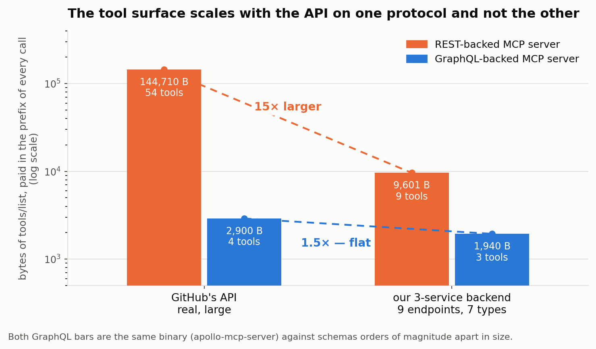

# GraphQL-backed MCP tools are more token-efficient

**Across 240 runs on a backend we controlled, the best GraphQL-backed MCP server beat the best
REST-backed one on all ten task instances — on wasted tokens and on cost per task. The margin
runs from 1.2× to 15.7×, and it tracks the shape of the question rather than its size. On
GitHub's live API, the N+1 case cost REST 64× the payload.**

We ran two experiments. **Phase 1** pointed MCP servers at GitHub's live API and asked the same
question through each — 24 runs, $0.53. **Phase 2** built a synthetic three-service airline
backend, generated a REST surface and a federated GraphQL surface from a single field
definition, and swept four questions over how many records they cover — 240 runs, $51.16.
Everything ran on `claude-haiku-4-5` at temperature 0, through Goose, behind a logging reverse
proxy that recorded the raw Anthropic `usage` object for every model call.

*This document is the argument. The per-cell tables, the mechanism, the scored pre-registration
and the caveats in full are in [`FINDINGS.md`](FINDINGS.md); the generated reports are in
[`results/`](results); how to run any of it is in [`README.md`](README.md).*

---

## What we ran

Eight condition cells in phase 2, reported as eight rows and never averaged together. Both
surfaces read the same records through the same repository: `services/src/entities/*.ts`
declares the fields once, and codegen emits the GraphQL SDL *and* the OpenAPI documents from
that one declaration, so neither side can be quietly hand-favoured.

| cell | protocol | how the API is packaged into tools | tools |
|---|---|---|--:|
| `M-R1-fat` | REST | one tool per endpoint, full payloads | 9 |
| `M-R1-lean` | REST | same, honouring `?fields=` | 9 |
| `M-R2-fat` | REST | generic tools over the OpenAPI spec | 3 |
| `M-R2-lean` | REST | same, honouring `?fields=` | 3 |
| `M-R3-fat` | REST | one generic HTTP tool, **no spec at all** | 1 |
| `M-G1` | GraphQL | schema discovery then execute, our server | 3 |
| `M-G2` | GraphQL | frozen persisted operations, one tool each | 7 |
| `M-G3` | GraphQL | schema discovery then execute, `apollo-mcp-server` | 3 |

`M-G3` is what makes the GraphQL axis separable: same implementation as `M-G2` with different
packaging, same packaging as `M-G1` with a different implementation. `M-G1` is a control we
wrote, not a product; `M-R2` and `M-R3` come from one binary in two modes, so the REST axis
varies packaging alone.

**REST was the steelman.** We gave it an OpenAPI document *generated from the implementation*,
so it can never be stale or partial; nine endpoints across three services with one naming
convention, one envelope and one pagination scheme; batch-by-id on every collection; and a
`?fields=` sparse-fieldset bracket. Payloads are deliberately bloated in ways named production
APIs actually are — envelope wrappers, code/label twins, denormalized nested objects — so a
flight comes back with 46 fields under the `fat` profile. GraphQL runs on Apollo Router v2.17.0
over three `@apollo/subgraph` services with per-request DataLoaders on every reference resolver.

Four questions, swept over how many records they cover: **M1** one service and batchable
(REST's best case), **M2** one record across three services, **M3** M2 swept over *N*, **M4** the
list in one service and the predicate in another. All ten instances are quoted verbatim in
[`tasks/tasks.yaml`](tasks/tasks.yaml), which is the only place the wording lives. M3, the
cross-service join, reads:

```
For each of these flights — {{ids}} — determine whether every assigned
pilot (the captain and the first officer) holds a type rating for that
flight's aircraft model which is still current as of {{as_of}}. Report one
line per flight: the flight id, then yes or no. Cover all {{n}} flights.
```

The headline metric is **pass-through tokens**: payload that entered the agent's context and
whose values never appear in its answer. That is the honest measure of waste — data the agent
carried, paid for on every subsequent call, and didn't use. All five phase-2 recipes carry a
byte-identical instruction block that names no tool and suggests no strategy.

---

## The result

**On the metric caching cannot touch, the arms do not overlap at all.**


All three GraphQL conditions place above all five REST conditions, on the mean and on the median
cell alike. The *worst* GraphQL condition carries 2.5× less than the *best* REST condition. That
ordering is the result, and adding a fifth REST cell widened the span rather than closing it.

Best GraphQL cell against best REST cell, instance by instance:

| task | best REST | best GraphQL | cost ratio | token ratio |
|---|--:|--:|--:|--:|
| M1 @ 1 | $0.0081 | $0.0046 | 1.76× | 15.71× |
| M1 @ 5 | $0.0145 | $0.0058 | 2.50× | 10.73× |
| M1 @ 20 | $0.0159 | $0.0111 | 1.43× | 1.18× |
| M1 @ 50 | $0.0251 | $0.0202 | 1.24× | 1.93× |
| M2 @ 1 | $0.0221 | $0.0068 | 3.25× | 3.55× |
| M3 @ 5 | $0.0858 | $0.0193 | 4.45× | 4.04× |
| M3 @ 20 | $0.2214 | $0.0480 | 4.61× | 2.89× |
| M3 @ 50 | $0.4765 | $0.0677 | 7.04× | 11.88× |
| M4 @ 20 | $0.0733 | $0.0233 | 3.15× | 4.95× |
| M4 @ 50 | $0.1287 | $0.0388 | 3.32× | 9.06× |

Median cell: **3.19× on cost, 4.49× on tokens.** Ten out of ten.

**There is no single multiple here, and the margin is not monotone in N.** It collapses as the
batchable single-service question grows and widens on the cross-service joins:


Two honest qualifications. **GraphQL did not win on round-trips** — the best REST configuration
made the same number of tool calls or fewer on five of the ten instances. And **no single
GraphQL condition wins everywhere**: `M-G2` and `M-G3` take five token cells each. What holds
without qualification is the arm-level ordering above.

**Accuracy is mostly not where the difference lives.** 178 of 239 graded runs scored a perfect
f1 and 53 of 80 condition/task cells were perfect outright. The widest gap is `M1@1` —
GraphQL 1.00 against REST 0.80 — and it is entirely `M-R3` failing three times out of three on
the simplest question in the matrix, which is the second result below.

On GitHub's live API in phase 1, five pull requests and their changed files cost REST's official
MCP server **26,970 tokens of tool results against GraphQL's 419** — 64× the payload at 7.9× the
cost, from ten tool calls against one. Phase 1 cannot separate protocol from packaging, which is
why phase 2 exists; it is here as the check that the synthetic backend is not the whole story.

---

## What generalises

Two things in this study are arithmetic rather than measurement.

**The tool surface scales with the API on one protocol and not the other.** It sits in the prefix
of every single call, paid whether the agent uses any of it or not.



REST runs roughly 1,000–2,700 bytes per endpoint. GraphQL does not move — the same binary, four
tools against the whole of GitHub's schema and three against ours, across a difference of orders
of magnitude in API size. **O(endpoints) against O(1).** Measured at the model rather than on the
wire, our nine-tool REST surface is 3,790–4,053 prefix tokens against GitHub's 54-tool server at
18,438–18,471, so **phase 2 understates what a production REST tool surface costs by about
4.8×**.

**The spec is not overhead you can shed.** `M-R3` — REST with the OpenAPI document taken away,
one tool, 786 bytes, the smallest surface in the study — finished **last of eight**. Removing
8,815 bytes from the prefix did not make REST cheaper; it produced two failures, neither of
which registers as an error anywhere in the instrumentation. It guessed that a flight number was
an id, got a clean 404, and reported that the flight did not exist — f1 0.00 in all three
replicates, at $0.0034 a run, the cheapest cell in the matrix and a wrong answer. Then it guessed
`flight_numbers` where the parameter is `flightNumbers`, the server silently dropped the unknown
parameter, and one call returned **122,549 bytes** of unfiltered collection — the right answer at
ten times the payload. The loud failure was cheap and wrong; the silent one was expensive and
right. Paths are guessable because they are conventional. **Parameter names are not.**

That sharpens the steelman: a generated, never-stale OpenAPI document was the most valuable thing
we handed the REST arm, and it is the thing production REST estates are least likely to have.
[`FINDINGS.md` §4](FINDINGS.md) has the full account.

---

## Two ways to forfeit it

Neither of these is protocol-imposed. Both are the mistakes a team adopting GraphQL for agents is
most likely to make, and they are worth more attention than the headline.

**Entity-scoped operations reimpose 1+N.** The single largest effect in the study is one argument
type:

```graphql
query FlightSchedule($flightNumbers: [String!]!)   #   1 request for 50 flights
query FlightRoster($flightId: ID!)                 # 100 requests for 50 flights
```

One takes a list because a departure board shows many flights; one takes an id because a roster
screen shows one. Both are reasonable API design. But an agent asking about fifty flights can
only call the second one fifty times, and it needs airworthiness too, so it goes twice per
flight — a hundred round-trips from a seven-tool surface that has not changed between the task it
wins and the task it loses. **Federation does not save you**: the fan-out has moved out of your
resolvers and into the agent's control flow, and a hundred separate executions have nothing to
batch. *If you ship persisted operations for agents, every one of them should accept a list.*

**The query language pays a discovery floor on small questions.** A condition that writes its own
queries has to find its way around the schema first, and it pays that on every run. On the
trivial single-record lookup the product condition cost 1.6× what REST did. The crossover is by
task *shape*, not cardinality: the query language never gets ahead of the best REST cell on the
batchable single-service question at any N, and crosses decisively on the multi-record
cross-service join. *Measure at your actual cardinality and your actual join depth.*

**And where the gap genuinely closes:** turning on `?fields=` cut `M-R1`'s pass-through tokens by
36%, and on the batchable task at fifty records it went from 36,598 to 2,652 — essentially tying
persisted operations. *If your REST API already supports field selection, do not migrate for
token efficiency alone; fix the default before you change the protocol.* But the client has to
use it, and ours often didn't: on the filter task at fifty flights, `fat` and `lean` differed by
66 tokens out of 46,665, because the agent never sent the parameter at all. **A protocol
capability the client does not exercise is not a defence of the protocol.**

---

## Limits

Four, stated in full with their evidence in [`FINDINGS.md` §Caveats](FINDINGS.md).

1. **The dollar figures are inflated, though the direction holds.** Phase 2 read zero cached
   tokens back across all 241 runs — every prefix sits under `claude-haiku-4-5`'s 4,096-token
   minimum cacheable prefix — so every call bills a cache write at 1.25× and reads nothing back.
   That penalises whichever condition makes the most calls, which here is a *GraphQL* one. In
   phase 1 the effect runs the other way and the 7.9× is understated. **Quote the direction of
   the cost figures, not their magnitude; the token counts are unaffected.**
2. **Averages misbehave on a matrix swept over N.** `M3@50` alone is 46.6% of the lean-REST
   pass-through numerator. Read the per-cell tables, not a summary multiple.
3. **The tokens are counted with the wrong tokenizer, in a known direction.** `cl100k_base` is
   OpenAI's encoding; cross-checked against the API's own `usage` it runs 14–22% low. Every
   pass-through figure here is a same-signed underestimate.
4. **One model, one harness, one backend.** The structural results cannot move — an operation
   taking a single id forces any model to loop — but whether an agent *chooses* to narrow fields
   is behaviour, and that observation is currently about one agent.

---

## Conclusion

On a backend we controlled, the best GraphQL-backed MCP server beat the best REST-backed one on
all ten task instances, on wasted tokens and on cost per task, by a median of 4.5× and 3.2×. On
GitHub's live API the same shape appears at 64× the payload. **The arms do not overlap on the
metric caching cannot touch** — that is the sentence to keep if you keep only one. And REST was
the steelman: a small, orderly, perfectly-documented three-service backend is the best case we
could have handed it, and it lost every instance.

What generalises is arithmetic. The tool surface scales with endpoint count on REST and not at
all on GraphQL. An operation whose only argument is a scalar id needs N calls to cover N records.
An endpoint that serves forty-six fields serves forty-six unless something asks otherwise. A join
moved into the agent's control flow is paid in inference, not in your backend.

What does not generalise is every multiple in this document. They are facts about these fixtures,
these tool surfaces and this agent — and there is no clean ranking *within* either arm, since the
conditions swap places depending on whether you rank by tokens, dollars or round-trips. Two of
our GraphQL conditions do the same thing and differ only in whose code exposes the schema; that
alone moved pass-through tokens in nine of ten cells. **If you benchmark an approach, you have
measured an implementation of it.**

If you take one thing beyond the ranking: **count the round-trips a realistic question costs, not
the bytes.** Our most *selective* condition was also our most expensive, because it made a hundred
requests. Payload efficiency is bounded by how many fields exist. Round-trip efficiency is bounded
by how many records the question covers, and that is the number that grows.

---

## Disclosure

This work was done by an employee of **Apollo GraphQL**, which sells GraphQL tooling, and it lives
in an Apollo-owned repository. Three of the conditions run Apollo software: phase-1 condition `B`
and phase-2 `M-G2` and `M-G3` use `apollo-mcp-server` v1.14.0, and the phase-2 GraphQL backend is
Apollo Router v2.17.0 over Apollo Server v5 subgraphs. That is a commercial interest in one of the
answers, and you should weight the framing accordingly — which is part of why this document
reports the per-cell tables instead of an average, states the cells where REST wins, and includes
the round-trip metric GraphQL loses on. The fixtures, recipes, graders and raw logs are in the
repository so you do not have to take the framing on trust.

*Everything here ran on `claude-haiku-4-5`. Reproducing it means setting `MODEL` explicitly — the
default in `bench.sh` is a different model. The three figures are generated from
`results/phase2/raw.csv` and `capture/*.json` by [`make_figures.py`](make_figures.py); no number
in them is typed by hand.*
