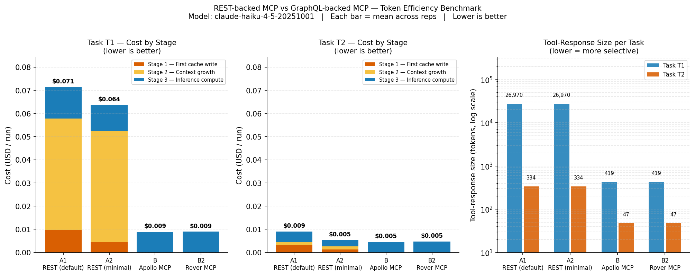

# Benchmark Results — REST-backed MCP vs GraphQL-backed MCP

## Key Findings

- **T1 (5 PRs + changed files) — REST vs GraphQL:** A1 uses **4 inference calls** vs B2's **3** (1.3× more). REST requires one get_pull_request + one get_pull_request_files call per PR; B2 fetches all five in one aliased GraphQL query. Cost: A1 $0.071 vs B2 $0.009 per run (**7.9× cheaper with B2**).
- **REST context overhead:** A1's tool schema and accumulated REST tool responses write **46K cache-creation tokens** ($0.058/run, 81% of total T1 cost). Each of A1's 4 inference calls extends the cached context with a full REST API payload; B2 writes only 0K tokens across its 3 calls.
- **T1 GraphQL comparison (B vs B2):** B2 (Rover Schema MCP, 3 tools) uses 3 vs B's 3 inference calls on T1, costing $0.009 vs $0.009/run. Rover's smaller tool schema and targeted keyword search keep schema-discovery overhead low.
- **T2 (single PR lookup):** B and B2 are indistinguishable ($0.005 vs $0.005/run, 3.0 vs 3.0 calls) — as expected for a control task both conditions answer in one execute. No claim is made about a difference this small.
- **Overall (all tasks):** B and B2 are close in combined cost ($0.013 vs $0.014/run); both are substantially cheaper than A1 ($0.080/run).

All values are **mean ± stdev** across reps. Source: per-call proxy logs (raw Anthropic `usage`). Cache tokens are reported **separately** and are never folded into `input_tokens`.

> Cross-check the headline numbers against the audit section and the raw logs in `runs/` before publishing.

## MCP conditions (A1 / A2 / B / B2)

### Task T1

| Condition | inference calls | tool calls | input tok | output tok | cache-read tok | cache-create tok | tool-payload tok |
|---|---|---|---|---|---|---|---|
| **A1** — REST (default toolset) | 4.0 ± 0.0 | 10.0 ± 0.0 | 213 ± 0 | 1,750 ± 2 | 46,633 ± 9,186 | 46,169 ± 9,183 | 26,970 ± 0 |
| **A2** — REST (minimal toolset) | 4.0 ± 0.0 | 10.0 ± 0.0 | 213 ± 0 | 1,734 ± 14 | 21,975 ± 4,478 | 42,002 ± 4,478 | 26,970 ± 0 |
| **B** — GraphQL (Apollo MCP) | 3.0 ± 0.0 | 1.0 ± 0.0 | 4,373 ± 0 | 899 ± 1 | 0.0 ± 0.0 | 0.0 ± 0.0 | 419 ± 0 |
| **B2** — GraphQL (Rover Schema MCP) | 3.0 ± 0.0 | 1.0 ± 0.0 | 4,470 ± 0 | 902 ± 0 | 0.0 ± 0.0 | 0.0 ± 0.0 | 419 ± 0 |

### Task T2

| Condition | inference calls | tool calls | input tok | output tok | cache-read tok | cache-create tok | tool-payload tok |
|---|---|---|---|---|---|---|---|
| **A1** — REST (default toolset) | 3.0 ± 0.0 | 1.0 ± 0.0 | 174 ± 0 | 217 ± 0 | 33,924 ± 0 | 3,504 ± 0 | 334 ± 0 |
| **A2** — REST (minimal toolset) | 3.0 ± 0.0 | 1.0 ± 0.0 | 174 ± 0 | 206 ± 3 | 16,158 ± 0 | 2,048 ± 0 | 334 ± 0 |
| **B** — GraphQL (Apollo MCP) | 3.0 ± 0.0 | 1.0 ± 0.0 | 3,543 ± 0 | 216 ± 0 | 0.0 ± 0.0 | 0.0 ± 0.0 | 47.0 ± 0.0 |
| **B2** — GraphQL (Rover Schema MCP) | 3.0 ± 0.0 | 1.0 ± 0.0 | 3,641 ± 0 | 224 ± 3 | 0.0 ± 0.0 | 0.0 ± 0.0 | 47.0 ± 0.0 |

### All tasks combined (per-run totals)

| Condition | inference calls | tool calls | input tok | output tok | cache-read tok | cache-create tok | tool-payload tok |
|---|---|---|---|---|---|---|---|
| **A1** — REST (default toolset) | 7.0 ± 0.0 | 11.0 ± 0.0 | 387 ± 0 | 1,967 ± 2 | 80,557 ± 9,186 | 49,673 ± 9,183 | 27,304 ± 0 |
| **A2** — REST (minimal toolset) | 7.0 ± 0.0 | 11.0 ± 0.0 | 387 ± 0 | 1,940 ± 13 | 38,133 ± 4,478 | 44,050 ± 4,478 | 27,304 ± 0 |
| **B** — GraphQL (Apollo MCP) | 6.0 ± 0.0 | 2.0 ± 0.0 | 7,916 ± 0 | 1,115 ± 1 | 0.0 ± 0.0 | 0.0 ± 0.0 | 466 ± 0 |
| **B2** — GraphQL (Rover Schema MCP) | 6.0 ± 0.0 | 2.0 ± 0.0 | 8,111 ± 0 | 1,126 ± 3 | 0.0 ± 0.0 | 0.0 ± 0.0 | 466 ± 0 |

## Prompt prefix and the cache minimum

The prefix is what the model receives on the first call that carries the tool surface: `input_tokens + cache_read_input_tokens + cache_creation_input_tokens`. All three, because on a warm call `cache_creation` is only the delta — the same call can read 15,911 tokens back and write 2,525, and 2,525 is not the prompt.

| Condition | Tools forwarded | Tool surface | Prefix tokens (min–max) | Cache minimum | Schema cached? |
|---|---|---|---|---|---|
| **A1** | 54 | — | 18,438–18,471 | 4,096 | yes |
| **A2** | 22 | — | 8,827–8,860 | 4,096 | yes |
| **B** | 4 | — | 1,576–1,609 | 4,096 | **no** — every prefix is below the minimum |
| **B2** | 3 | — | 1,623–1,656 | 4,096 | **no** — every prefix is below the minimum |

**12 of 24 runs carry a prefix below their model's cache minimum (B, B2), so in those runs the tool surface is never written to cache at all.** Their first `cache_creation` charge fires when the *conversation* crosses the minimum, several tool rounds in — which is why Stage 1 below is labelled for that event and not for schema loading. Where a surface does clear the minimum on its own, a fatter one really does buy a bigger Stage 1; where it does not, it buys a bigger uncached `input_tokens` bill on every call until the conversation grows past the threshold. The two are not the same cost and the Stage 1 column does not distinguish them — this table is how you tell which one a row is.

## How to read these numbers

Every inference run goes through three phases. Understanding them explains why the token counts look the way they do.

**First cache write (Stage 1)** — Before Claude can act, the harness sends it a full description of every available tool. For REST conditions (A1/A2) that's 17–22 endpoint definitions; for GraphQL (B/B2) it's just 3–4 generic tools. Anthropic will cache that context, but only once the prompt clears the model's **minimum cacheable prefix** — which is model-dependent and not monotonic in model size (4,096 tokens on Haiku 4.5, 1,024 on Sonnet 5, 512 on Opus 5), so it cannot be inferred from the model name. Stage 1 captures the `cache_creation` charge for the first write that happens. **It is named for that event, not for schema loading**, and the two coincide only when the tool surface alone clears the minimum — see the prefix table above for whether it does here. When it does not, the first write fires several tool rounds in, once the *conversation* has grown past the threshold, and the tool surface is paid at the uncached `input_tokens` rate on every call until then. This section previously read "once it exceeds ~1 000 tokens" and attributed Stage 1 to schema size; ~1,000 is Sonnet's minimum, and the wrong threshold is what left the zero-cache-read finding without a mechanism.

**Context growth (Stage 2)** — Each tool call extends the conversation: the tool's response is appended and the *now-longer* context must be written to cache again so the next inference call can read it cheaply. Stage 2 sums those incremental `cache_creation` charges — the cost of *maintaining* the cache as it grows, not of using it. Two factors drive Stage 2 higher: more round trips (more re-writes) and larger payloads per round trip (more new tokens to cache each time). REST conditions are penalised on both axes: 10 tool calls vs. 1, and full REST API objects (~82 KB for 5 PRs) vs. GraphQL's field-precise responses (~1 KB). Stage 2 is where most of the REST–GraphQL cost difference accumulates.

**Inference compute (Stage 3)** — The cost of the model *reading and generating*, not writing. It has three components: `cache_read_input_tokens` (tokens pulled from the cache Stages 1–2 built — cheap but not free), `input_tokens` (any prompt tokens processed fresh, not from cache), and `output_tokens` (tokens Claude generates). Stage 3 is roughly constant across conditions for the same task, because the task prompt and final answer are similar in size regardless of which API protocol answered the question. It does not include cache-write charges — those are entirely in Stages 1 and 2.

The three stages are additive — total cost = Stage 1 + Stage 2 + Stage 3. **One cross-condition caveat:** A1/A2's tool surface clears the cache minimum on its own (an 18,438-token prefix against Haiku 4.5's 4,096), so their first write really is schema injection. B/B2's does not, so their Stage 1 fires later in the conversation and includes early turns that REST pays in Stage 2. The two arms' Stage 1 figures are therefore not the same quantity. The Stage 1 + Stage 2 sum and Stage 3 are the reliable cross-condition comparators. The stage split is most useful within a single condition to understand how its cost is structured.

## Cost breakdown by prompt lifecycle stage

Each run's cost is split across the three stages of the inference prompt lifecycle. All values are **mean USD/run** across reps.

| Condition | Task | Stage 1 — First cache write | Stage 2 — Context growth | Stage 3 — Inference compute | Total |
|---|---|---|---|---|---|
| **A1** — REST (default toolset) | T1 | $0.0098 | $0.0479 | $0.0136 | **$0.0713** |
| **A1** — REST (default toolset) | T2 | $0.0032 | $0.0012 | $0.0047 | **$0.0090** |
| **A2** — REST (minimal toolset) | T1 | $0.0046 | $0.0479 | $0.0111 | **$0.0636** |
| **A2** — REST (minimal toolset) | T2 | $0.0013 | $0.0012 | $0.0028 | **$0.0054** |
| **B** — GraphQL (Apollo MCP) | T1 | $0.0000 | $0.0000 | $0.0089 | **$0.0089** |
| **B** — GraphQL (Apollo MCP) | T2 | $0.0000 | $0.0000 | $0.0046 | **$0.0046** |
| **B2** — GraphQL (Rover Schema MCP) | T1 | $0.0000 | $0.0000 | $0.0090 | **$0.0090** |
| **B2** — GraphQL (Rover Schema MCP) | T2 | $0.0000 | $0.0000 | $0.0048 | **$0.0048** |

*Stage 1: first non-zero `cache_creation_input_tokens` call. Stage 2: all subsequent `cache_creation_input_tokens`. Stage 3: `input_tokens` + `output_tokens` + `cache_read_input_tokens` across all calls. **Cross-condition caveat:** the Stage 1 / Stage 2 boundary falls at a different point in the conversation for each condition. A1/A2's 18,438-token prefix clears the 4,096-token minimum on call 1, so their Stage 1 is schema injection. B/B2's small surface does not, so their first write waits for the conversation to grow and their Stage 1 absorbs early tool rounds that REST pays in Stage 2. The Stage 1 + Stage 2 sum (total cache-create cost) and Stage 3 are the reliable cross-condition comparators; the individual stage split reflects within-condition structure, not a symmetric breakdown.*

## Estimated cost (USD)

Pricing per model (USD/1M tokens) — claude-haiku-4-5-20251001: input $1.0/1M out $5.0/1M cc $1.25/1M cr $0.1/1M.

| Condition | Task | Reps | mean $/run | total $ (all reps) |
|---|---|---|---|---|
| **A1** — REST (default toolset) | T1 | 3 | $0.0713 | $0.2140 |
| **A1** — REST (default toolset) | T2 | 3 | $0.0090 | $0.0271 |
| **A2** — REST (minimal toolset) | T1 | 3 | $0.0636 | $0.1908 |
| **A2** — REST (minimal toolset) | T2 | 3 | $0.0054 | $0.0161 |
| **B** — GraphQL (Apollo MCP) | T1 | 3 | $0.0089 | $0.0266 |
| **B** — GraphQL (Apollo MCP) | T2 | 3 | $0.0046 | $0.0139 |
| **B2** — GraphQL (Rover Schema MCP) | T1 | 3 | $0.0090 | $0.0269 |
| **B2** — GraphQL (Rover Schema MCP) | T2 | 3 | $0.0048 | $0.0143 |

**Grand total across all conditions/tasks/reps: $0.5297**

## Timing (seconds)

`wall_s` = total run duration including MCP server cold-start. `active_s` = first inference response → last inference response — excludes initialization overhead. In persistent-server deployments (the typical MCP usage pattern) `active_s` is the operative metric.

| Condition | Task | wall_s (mean ± sd) | active_s (mean ± sd) |
|---|---|---|---|
| **A1** — REST (default toolset) | T1 | 22.3 ± 2.9s | 10.7 ± 0.6s |
| **A1** — REST (default toolset) | T2 | 5.5 ± 0.1s | 2.4 ± 0.2s |
| **A2** — REST (minimal toolset) | T1 | 20.6 ± 0.1s | 9.9 ± 0.6s |
| **A2** — REST (minimal toolset) | T2 | 5.6 ± 0.1s | 2.0 ± 0.2s |
| **B** — GraphQL (Apollo MCP) | T1 | 10.6 ± 0.1s | 3.4 ± 0.9s |
| **B** — GraphQL (Apollo MCP) | T2 | 5.6 ± 0.1s | 2.0 ± 0.3s |
| **B2** — GraphQL (Rover Schema MCP) | T1 | 10.6 ± 0.1s | 4.0 ± 0.2s |
| **B2** — GraphQL (Rover Schema MCP) | T2 | 5.6 ± 0.1s | 2.2 ± 0.1s |

## Audit — per-run disclosure & completion

Headline metrics count only **task-model** (`claude-haiku-4-5-20251001`) calls. `aux` = auxiliary calls on a different model (e.g. Goose session-title generation on Haiku) — excluded from the headline, shown here for full disclosure. `unparsed` should be 0.

| Cond | Task | Rep | calls | input | cache-read | cost $ | wall_s | active_s | aux calls | aux tok | unparsed | completed | exit |
|---|---|---|---|---|---|---|---|---|---|---|---|---|---|
| A1 | T1 | 1 | 4 | 213 | 36026 | $0.084 | 25.6s | 10.7s | 0 | 0 | 0 | yes | 0 |
| A1 | T1 | 2 | 4 | 213 | 51937 | $0.065 | 20.6s | 10.2s | 0 | 0 | 0 | yes | 0 |
| A1 | T1 | 3 | 4 | 213 | 51937 | $0.065 | 20.6s | 11.3s | 0 | 0 | 0 | yes | 0 |
| A1 | T2 | 1 | 3 | 174 | 33924 | $0.009 | 5.5s | 2.2s | 0 | 0 | 0 | yes | 0 |
| A1 | T2 | 2 | 3 | 174 | 33924 | $0.009 | 5.5s | 2.5s | 0 | 0 | 0 | yes | 0 |
| A1 | T2 | 3 | 3 | 174 | 33924 | $0.009 | 5.6s | 2.5s | 0 | 0 | 0 | yes | 0 |
| A2 | T1 | 1 | 4 | 213 | 16804 | $0.069 | 20.6s | 9.5s | 0 | 0 | 0 | yes | 0 |
| A2 | T1 | 2 | 4 | 213 | 24560 | $0.061 | 20.6s | 9.7s | 0 | 0 | 0 | yes | 0 |
| A2 | T1 | 3 | 4 | 213 | 24560 | $0.061 | 20.7s | 10.6s | 0 | 0 | 0 | yes | 0 |
| A2 | T2 | 1 | 3 | 174 | 16158 | $0.005 | 5.6s | 2.3s | 0 | 0 | 0 | yes | 0 |
| A2 | T2 | 2 | 3 | 174 | 16158 | $0.005 | 5.5s | 1.9s | 0 | 0 | 0 | yes | 0 |
| A2 | T2 | 3 | 3 | 174 | 16158 | $0.005 | 5.7s | 1.9s | 0 | 0 | 0 | yes | 0 |
| B | T1 | 1 | 3 | 4373 | 0 | $0.009 | 10.6s | 4.4s | 0 | 0 | 0 | yes | 0 |
| B | T1 | 2 | 3 | 4373 | 0 | $0.009 | 10.5s | 2.7s | 0 | 0 | 0 | yes | 0 |
| B | T1 | 3 | 3 | 4373 | 0 | $0.009 | 10.6s | 3.0s | 0 | 0 | 0 | yes | 0 |
| B | T2 | 1 | 3 | 3543 | 0 | $0.005 | 5.6s | 1.8s | 0 | 0 | 0 | yes | 0 |
| B | T2 | 2 | 3 | 3543 | 0 | $0.005 | 5.5s | 2.4s | 0 | 0 | 0 | yes | 0 |
| B | T2 | 3 | 3 | 3543 | 0 | $0.005 | 5.7s | 1.8s | 0 | 0 | 0 | yes | 0 |
| B2 | T1 | 1 | 3 | 4470 | 0 | $0.009 | 10.7s | 3.9s | 0 | 0 | 0 | yes | 0 |
| B2 | T1 | 2 | 3 | 4470 | 0 | $0.009 | 10.6s | 3.8s | 0 | 0 | 0 | yes | 0 |
| B2 | T1 | 3 | 3 | 4470 | 0 | $0.009 | 10.6s | 4.2s | 0 | 0 | 0 | yes | 0 |
| B2 | T2 | 1 | 3 | 3641 | 0 | $0.005 | 5.6s | 2.1s | 0 | 0 | 0 | yes | 0 |
| B2 | T2 | 2 | 3 | 3641 | 0 | $0.005 | 5.6s | 2.2s | 0 | 0 | 0 | yes | 0 |
| B2 | T2 | 3 | 3 | 3641 | 0 | $0.005 | 5.7s | 2.2s | 0 | 0 | 0 | yes | 0 |

*Every figure comes from the per-run proxy log — raw `usage` off the wire, one file per run, no shared state. Anything but `yes` under `completed` names what stopped the run: a **turn cap** exits 0 and is invisible everywhere else in this row, so this column is the only place it shows. `budget kill` = the runner killed goose when per-run cost exceeded `PER_RUN_BUDGET_USD` — the partial cost is real and reported; the answer is incomplete. Both should be re-run or excluded.*

