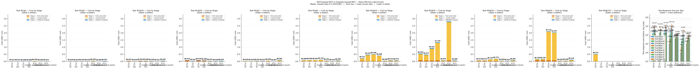

# Phase 2 Results — who performs the join

## Key Findings

- **The protocol is not the variable — the tool surface is, in two separate ways, and two tasks isolate them.** On **M1@50 every condition makes about one data call** (1 for M-R1-fat, 1 for M-G2), so call count is controlled and the whole spread there is **field selectivity**. Two of the GraphQL conditions then invert that on M3@50: their payloads differ by only 3.4× (11,863 against 40,253 tokens) while their tool calls differ by 14.3× (7 against 100) — so that spread is **cardinality match**, whether the operation you have accepts the cardinality the question has. Two independent taxes; a condition can lose on either.
- **Selectivity tax (M1@50, one call each): 36,598 pass-through tokens for fat REST against 2,352 for frozen GraphQL operations (15.6×), 92% of it never reaching the answer against 50%.** This is the headline join-tax number and it is entirely about which fields come back, not about who joins. **`?fields=` erases it**: the same REST surface in the lean bracket carries 2,652 tokens, within 1.1× of GraphQL. On selectivity alone, REST with field selection is competitive — the gap is a default, not a protocol limit.
- **Cardinality tax (M3@50): GraphQL is both the cheapest and the most expensive condition in the matrix.** M-G1 answered the whole 50-flight join in **one `graphql_execute`** (7 tool calls in total, the rest schema discovery) for $0.079; M-G2 needed **100** calls, one pair per flight, for $2.803 (35.5× the cost); REST sat between them at 4 calls and $0.550. M-G2 has federation underneath and still loops, because none of its seven frozen operations accepts more than one flight — `FlightRoster(flightId)` is sized to a roster screen. **Entity-scoped operations reimpose the 1+N pattern federation exists to remove.** DataLoader cannot help: each call is an honest single-flight query from its own agent turn, so the fan-out has moved above the layer where resolver batching reaches.
- **The clean control: the same seven tools, inverted by the question.** M-G2 is second only to M-G3 on M1@50 payload and the costliest on M3@50, with no change to its surface between them: 1 call there, 100 here. `FlightSchedule(flightNumbers: [String!]!)` takes a list; `FlightRoster(flightId: ID!)` takes one id. Same protocol, same server, same seven tools — the only difference is whether the operation that fits the question happens to accept the question's cardinality. That is the actionable finding: **"adopt GraphQL" is not the advice — expose an operation shaped like the question, or expose the query language.**
- **REST's steelman is real and unreliable in the same breath.** `-lean` cut M1@20 pass-through by 13.2× — and on M4@50 it changed **nothing**: 46,665 tokens fat against 46,599 lean, because the agent never sent `?fields=`. The optimisation was available, documented in the tool schema, and unused. A protocol capability the client does not exercise is not a defence of the protocol.
- **Accuracy is not where the difference lives.** 164 of 210 graded runs scored a perfect f1. 209 of 210 passed the grounding check, and 1 could not be assessed because the answer states no checkable fact. That check asks whether each *correct* value an answer states appears in the tool results that arrived — retrieval-happened, not per-fact provenance, so a run that flips a verdict scores f1 0.00 and still passes it. It does not license "nothing was fabricated". The widest protocol gap is **M4@50: GraphQL 0.97 against REST 0.83** — and 49 of 70 condition/task cells are perfect outright, so most of the matrix shows no accuracy difference at all. The agents get the answer either way. What differs is what it costs to get it, which is why this report leads with payload and calls rather than correctness.
- **Read the dollar column with this caveat.** Prompt caching never hit once in this matrix: **0 of 211 runs read a single cached token**, while 158 of 170 multi-call runs wrote 33,095,583 of them. (The 12 multi-call runs not counted there wrote nothing either — too small to cache — so this is not a subset that hit.) Writes cost 1.25x and reads 0.1x, so the inflation scales with **call count** — which penalises exactly the many-call conditions, in the direction the hypothesis predicts. **The call counts and token ratios above are cache-independent and hold; the dollar magnitudes are inflated and their direction is all that should be quoted.** `NOTES.md` 51.

All values are **mean ± stdev** across reps. Source: per-call proxy logs (raw Anthropic `usage`). Cache tokens are reported **separately** and are never folded into `input_tokens`.

> Cross-check the headline numbers against the audit section and the raw logs in `runs/` before publishing.

## MCP conditions (M-R1-fat / M-R1-lean / M-R2-fat / M-R2-lean / M-G1 / M-G2 / M-G3)

### Task M1@1

| Condition | inference calls | tool calls | input tok | output tok | cache-read tok | cache-create tok | tool-payload tok |
|---|---|---|---|---|---|---|---|
| **M-R1-fat** — REST (one tool per endpoint), fat payloads | 3.0 ± 0.0 | 1.0 ± 0.0 | 4,014 ± 0 | 118 ± 0 | 0.0 ± 0.0 | 4,942 ± 0 | 867 ± 0 |
| **M-R1-lean** — REST (one tool per endpoint), lean payloads | 3.0 ± 0.0 | 1.0 ± 0.0 | 4,014 ± 0 | 119 ± 1 | 0.0 ± 0.0 | 4,941 ± 0 | 866 ± 0 |
| **M-R2-fat** — REST (search + describe + request), fat payloads | 4.0 ± 0.0 | 2.0 ± 0.0 | 6,823 ± 2 | 250 ± 1 | 0.0 ± 0.0 | 0.0 ± 0.0 | 1,043 ± 1 |
| **M-R2-lean** — REST (search + describe + request), lean payloads | 4.0 ± 0.0 | 2.0 ± 0.0 | 6,822 ± 0 | 246 ± 5 | 0.0 ± 0.0 | 0.0 ± 0.0 | 1,042 ± 0 |
| **M-G1** — GraphQL (search + describe + execute, our server) | 7.0 ± 1.7 | 5.0 ± 1.7 | 6,694 ± 1,488 | 474 ± 137 | 0.0 ± 0.0 | 16,895 ± 13,183 | 3,597 ± 2,118 |
| **M-G2** — GraphQL (frozen persisted operations, Apollo MCP) | 3.0 ± 0.0 | 1.0 ± 0.0 | 4,095 ± 0 | 109 ± 2 | 0.0 ± 0.0 | 0.0 ± 0.0 | 103 ± 0 |
| **M-G3** — GraphQL (search + validate + execute, Apollo MCP) | 5.7 ± 1.2 | 3.7 ± 1.2 | 10,830 ± 3,655 | 364 ± 85 | 0.0 ± 0.0 | 0.0 ± 0.0 | 1,043 ± 368 |

### Task M1@5

| Condition | inference calls | tool calls | input tok | output tok | cache-read tok | cache-create tok | tool-payload tok |
|---|---|---|---|---|---|---|---|
| **M-R1-fat** — REST (one tool per endpoint), fat payloads | 3.0 ± 0.0 | 1.0 ± 0.0 | 4,048 ± 0 | 238 ± 0 | 0.0 ± 0.0 | 8,697 ± 0 | 4,007 ± 0 |
| **M-R1-lean** — REST (one tool per endpoint), lean payloads | 3.0 ± 0.0 | 1.0 ± 0.0 | 4,048 ± 0 | 250 ± 21 | 0.0 ± 0.0 | 7,347 ± 2,338 | 2,861 ± 1,984 |
| **M-R2-fat** — REST (search + describe + request), fat payloads | 5.0 ± 0.0 | 3.0 ± 0.0 | 5,654 ± 1 | 426 ± 1 | 0.0 ± 0.0 | 6,937 ± 1 | 4,204 ± 0 |
| **M-R2-lean** — REST (search + describe + request), lean payloads | 5.0 ± 0.0 | 3.0 ± 0.0 | 5,655 ± 0 | 426 ± 0 | 0.0 ± 0.0 | 6,939 ± 0 | 4,205 ± 0 |
| **M-G1** — GraphQL (search + describe + execute, our server) | 8.3 ± 3.1 | 6.3 ± 3.1 | 5,132 ± 1,465 | 841 ± 317 | 0.0 ± 0.0 | 28,146 ± 11,914 | 4,808 ± 2,307 |
| **M-G2** — GraphQL (frozen persisted operations, Apollo MCP) | 3.0 ± 0.0 | 1.0 ± 0.0 | 4,611 ± 0 | 247 ± 0 | 0.0 ± 0.0 | 0.0 ± 0.0 | 478 ± 0 |
| **M-G3** — GraphQL (search + validate + execute, Apollo MCP) | 8.0 ± 0.0 | 6.0 ± 0.0 | 17,401 ± 6 | 741 ± 2 | 0.0 ± 0.0 | 0.0 ± 0.0 | 1,375 ± 0 |

### Task M1@20

| Condition | inference calls | tool calls | input tok | output tok | cache-read tok | cache-create tok | tool-payload tok |
|---|---|---|---|---|---|---|---|
| **M-R1-fat** — REST (one tool per endpoint), fat payloads | 3.0 ± 0.0 | 1.0 ± 0.0 | 4,172 ± 0 | 767 ± 6 | 0.0 ± 0.0 | 22,870 ± 0 | 15,832 ± 0 |
| **M-R1-lean** — REST (one tool per endpoint), lean payloads | 3.0 ± 0.0 | 1.0 ± 0.0 | 4,172 ± 0 | 730 ± 1 | 0.0 ± 0.0 | 6,427 ± 0 | 1,979 ± 0 |
| **M-R2-fat** — REST (search + describe + request), fat payloads | 5.3 ± 0.6 | 3.3 ± 0.6 | 5,905 ± 3 | 961 ± 62 | 0.0 ± 0.0 | 24,827 ± 6,537 | 17,228 ± 2,106 |
| **M-R2-lean** — REST (search + describe + request), lean payloads | 5.7 ± 0.6 | 3.7 ± 0.6 | 5,906 ± 3 | 974 ± 45 | 0.0 ± 0.0 | 23,140 ± 8,391 | 13,833 ± 7,172 |
| **M-G1** — GraphQL (search + describe + execute, our server) | 5.0 ± 0.0 | 3.7 ± 0.6 | 3,865 ± 1 | 1,092 ± 28 | 0.0 ± 0.0 | 15,748 ± 118 | 5,271 ± 14 |
| **M-G2** — GraphQL (frozen persisted operations, Apollo MCP) | 3.0 ± 0.0 | 1.0 ± 0.0 | 2,205 ± 0 | 721 ± 12 | 0.0 ± 0.0 | 4,268 ± 0 | 1,878 ± 0 |
| **M-G3** — GraphQL (search + validate + execute, Apollo MCP) | 11.3 ± 3.1 | 9.3 ± 3.1 | 20,754 ± 5,862 | 1,461 ± 274 | 0.0 ± 0.0 | 11,396 ± 8,039 | 2,291 ± 544 |

### Task M1@50

| Condition | inference calls | tool calls | input tok | output tok | cache-read tok | cache-create tok | tool-payload tok |
|---|---|---|---|---|---|---|---|
| **M-R1-fat** — REST (one tool per endpoint), fat payloads | 3.0 ± 0.0 | 1.0 ± 0.0 | 4,422 ± 0 | 2,003 ± 13 | 0.0 ± 0.0 | 51,250 ± 27 | 39,600 ± 9 |
| **M-R1-lean** — REST (one tool per endpoint), lean payloads | 3.0 ± 0.0 | 1.0 ± 0.0 | 4,422 ± 0 | 1,631 ± 25 | 0.0 ± 0.0 | 10,003 ± 0 | 4,817 ± 0 |
| **M-R2-fat** — REST (search + describe + request), fat payloads | 5.0 ± 0.0 | 3.0 ± 0.0 | 6,408 ± 8 | 1,928 ± 222 | 0.0 ± 0.0 | 49,452 ± 1 | 39,786 ± 2 |
| **M-R2-lean** — REST (search + describe + request), lean payloads | 5.3 ± 0.6 | 3.3 ± 0.6 | 6,414 ± 10 | 1,955 ± 194 | 0.0 ± 0.0 | 39,541 ± 17,159 | 29,410 ± 17,969 |
| **M-G1** — GraphQL (search + describe + execute, our server) | 5.0 ± 0.0 | 3.0 ± 0.0 | 4,396 ± 1 | 2,134 ± 5 | 0.0 ± 0.0 | 17,350 ± 5 | 6,153 ± 0 |
| **M-G2** — GraphQL (frozen persisted operations, Apollo MCP) | 3.0 ± 0.0 | 1.0 ± 0.0 | 2,455 ± 0 | 1,616 ± 2 | 0.0 ± 0.0 | 7,737 ± 0 | 4,681 ± 0 |
| **M-G3** — GraphQL (search + validate + execute, Apollo MCP) | 7.7 ± 2.5 | 5.7 ± 2.5 | 13,105 ± 5,637 | 2,056 ± 207 | 0.0 ± 0.0 | 7,012 ± 3,040 | 2,668 ± 387 |

### Task M2@1

| Condition | inference calls | tool calls | input tok | output tok | cache-read tok | cache-create tok | tool-payload tok |
|---|---|---|---|---|---|---|---|
| **M-R1-fat** — REST (one tool per endpoint), fat payloads | 4.7 ± 1.2 | 5.0 ± 0.0 | 4,046 ± 6 | 663 ± 51 | 0.0 ± 0.0 | 17,748 ± 6,734 | 3,537 ± 0 |
| **M-R1-lean** — REST (one tool per endpoint), lean payloads | 4.0 ± 0.0 | 5.0 ± 0.0 | 4,043 ± 0 | 610 ± 42 | 0.0 ± 0.0 | 13,380 ± 778 | 3,132 ± 700 |
| **M-R2-fat** — REST (search + describe + request), fat payloads | 4.3 ± 0.6 | 5.3 ± 0.6 | 4,071 ± 3,865 | 749 ± 22 | 0.0 ± 0.0 | 19,441 ± 11,085 | 8,575 ± 4,092 |
| **M-R2-lean** — REST (search + describe + request), lean payloads | 5.3 ± 0.6 | 6.3 ± 0.6 | 9,692 ± 2,009 | 796 ± 47 | 0.0 ± 0.0 | 6,729 ± 179 | 3,908 ± 98 |
| **M-G1** — GraphQL (search + describe + execute, our server) | 7.7 ± 0.6 | 7.0 ± 1.0 | 5,656 ± 1,228 | 896 ± 49 | 0.0 ± 0.0 | 31,272 ± 4,376 | 5,702 ± 1,024 |
| **M-G2** — GraphQL (frozen persisted operations, Apollo MCP) | 3.0 ± 0.0 | 2.0 ± 0.0 | 5,086 ± 0 | 346 ± 3 | 0.0 ± 0.0 | 0.0 ± 0.0 | 884 ± 0 |
| **M-G3** — GraphQL (search + validate + execute, Apollo MCP) | 13.7 ± 3.5 | 11.7 ± 3.5 | 13,560 ± 19 | 1,591 ± 412 | 0.0 ± 0.0 | 56,686 ± 30,462 | 8,811 ± 4,719 |

### Task M3@5

| Condition | inference calls | tool calls | input tok | output tok | cache-read tok | cache-create tok | tool-payload tok |
|---|---|---|---|---|---|---|---|
| **M-R1-fat** — REST (one tool per endpoint), fat payloads | 5.3 ± 0.6 | 25.0 ± 0.0 | 4,056 ± 3 | 2,198 ± 295 | 0.0 ± 0.0 | 56,597 ± 8,290 | 17,536 ± 6 |
| **M-R1-lean** — REST (one tool per endpoint), lean payloads | 6.0 ± 0.0 | 25.0 ± 0.0 | 4,059 ± 0 | 2,034 ± 3 | 0.0 ± 0.0 | 65,482 ± 3 | 17,535 ± 3 |
| **M-R2-fat** — REST (search + describe + request), fat payloads | 7.0 ± 0.0 | 9.3 ± 7.5 | 1,860 ± 0 | 1,619 ± 409 | 0.0 ± 0.0 | 64,625 ± 2,658 | 17,564 ± 651 |
| **M-R2-lean** — REST (search + describe + request), lean payloads | 8.0 ± 1.7 | 19.0 ± 1.7 | 1,865 ± 9 | 2,258 ± 257 | 0.0 ± 0.0 | 84,767 ± 29,654 | 19,035 ± 1,240 |
| **M-G1** — GraphQL (search + describe + execute, our server) | 6.3 ± 0.6 | 11.0 ± 2.6 | 4,692 ± 3 | 1,866 ± 321 | 0.0 ± 0.0 | 30,594 ± 5,400 | 6,440 ± 43 |
| **M-G2** — GraphQL (frozen persisted operations, Apollo MCP) | 3.3 ± 0.6 | 10.0 ± 0.0 | 2,079 ± 3 | 1,024 ± 27 | 0.0 ± 0.0 | 9,660 ± 3,732 | 4,465 ± 0 |
| **M-G3** — GraphQL (search + validate + execute, Apollo MCP) | 10.7 ± 1.2 | 8.7 ± 1.2 | 12,949 ± 1,848 | 1,475 ± 159 | 0.0 ± 0.0 | 29,888 ± 4,642 | 4,424 ± 201 |

### Task M3@20

| Condition | inference calls | tool calls | input tok | output tok | cache-read tok | cache-create tok | tool-payload tok |
|---|---|---|---|---|---|---|---|
| **M-R1-fat** — REST (one tool per endpoint), fat payloads | 5.3 ± 0.6 | 10.3 ± 11.0 | 4,206 ± 3 | 3,411 ± 761 | 0.0 ± 0.0 | 160,101 ± 28,964 | 60,579 ± 1,128 |
| **M-R1-lean** — REST (one tool per endpoint), lean payloads | 15.3 ± 16.2 | 60.3 ± 0.6 | 4,256 ± 81 | 5,911 ± 606 | 0.0 ± 0.0 | 349,272 ± 497,464 | 21,832 ± 2,137 |
| **M-R2-fat** — REST (search + describe + request), fat payloads | 11.7 ± 1.2 | 10.3 ± 2.3 | 4,979 ± 5,107 | 3,972 ± 424 | 0.0 ± 0.0 | 386,340 ± 102,916 | 70,529 ± 4,960 |
| **M-R2-lean** — REST (search + describe + request), lean payloads | 9.7 ± 2.3 | 7.7 ± 2.3 | 2,023 ± 12 | 3,612 ± 427 | 0.0 ± 0.0 | 310,140 ± 99,407 | 61,485 ± 9,980 |
| **M-G1** — GraphQL (search + describe + execute, our server) | 6.0 ± 0.0 | 5.0 ± 0.0 | 3,803 ± 0 | 2,075 ± 51 | 0.0 ± 0.0 | 27,040 ± 7 | 8,456 ± 0 |
| **M-G2** — GraphQL (frozen persisted operations, Apollo MCP) | 4.0 ± 0.0 | 40.0 ± 0.0 | 2,232 ± 0 | 3,290 ± 126 | 0.0 ± 0.0 | 43,270 ± 4 | 17,831 ± 0 |
| **M-G3** — GraphQL (search + validate + execute, Apollo MCP) | 10.7 ± 2.5 | 8.7 ± 2.5 | 13,369 ± 5,814 | 2,489 ± 646 | 0.0 ± 0.0 | 37,818 ± 18,628 | 8,147 ± 2,049 |

### Task M3@50

| Condition | inference calls | tool calls | input tok | output tok | cache-read tok | cache-create tok | tool-payload tok |
|---|---|---|---|---|---|---|---|
| **M-R1-fat** — REST (one tool per endpoint), fat payloads | 6.0 ± 0.0 | 4.0 ± 0.0 | 4,509 ± 0 | 5,226 ± 233 | 0.0 ± 0.0 | 415,849 ± 57 | 139,507 ± 1 |
| **M-R1-lean** — REST (one tool per endpoint), lean payloads | 6.3 ± 0.6 | 4.3 ± 0.6 | 4,511 ± 3 | 6,011 ± 752 | 0.0 ± 0.0 | 353,581 ± 244,532 | 104,938 ± 59,946 |
| **M-R2-fat** — REST (search + describe + request), fat payloads | 10.7 ± 0.6 | 10.0 ± 2.6 | 5,001 ± 4,630 | 6,891 ± 1,592 | 0.0 ± 0.0 | 708,112 ± 172,157 | 152,828 ± 5,317 |
| **M-R2-lean** — REST (search + describe + request), lean payloads | 13.3 ± 4.2 | 11.0 ± 3.6 | 2,340 ± 18 | 6,670 ± 2,761 | 0.0 ± 0.0 | 1,039,906 ± 212,190 | 186,156 ± 51,061 |
| **M-G1** — GraphQL (search + describe + execute, our server) | 7.0 ± 0.0 | 7.0 ± 0.0 | 5,289 ± 73 | 3,218 ± 1,565 | 0.0 ± 0.0 | 46,124 ± 288 | 14,684 ± 59 |
| **M-G2** — GraphQL (frozen persisted operations, Apollo MCP) | 44.0 ± 0.0 | 100 ± 0 | 2,732 ± 0 | 8,624 ± 202 | 0.0 ± 0.0 | 2,205,403 ± 0 | 44,461 ± 0 |
| **M-G3** — GraphQL (search + validate + execute, Apollo MCP) | 8.0 ± 0.0 | 6.0 ± 0.0 | 7,682 ± 2 | 4,126 ± 131 | 0.0 ± 0.0 | 31,527 ± 749 | 11,824 ± 712 |

### Task M4@20

| Condition | inference calls | tool calls | input tok | output tok | cache-read tok | cache-create tok | tool-payload tok |
|---|---|---|---|---|---|---|---|
| **M-R1-fat** — REST (one tool per endpoint), fat payloads | 4.0 ± 0.0 | 20.0 ± 0.0 | 3,973 ± 0 | 1,118 ± 1 | 0.0 ± 0.0 | 50,981 ± 6 | 19,652 ± 6 |
| **M-R1-lean** — REST (one tool per endpoint), lean payloads | 4.0 ± 0.0 | 20.0 ± 0.0 | 3,973 ± 0 | 1,129 ± 16 | 0.0 ± 0.0 | 50,977 ± 6 | 19,648 ± 6 |
| **M-R2-fat** — REST (search + describe + request), fat payloads | 6.7 ± 2.3 | 22.7 ± 2.3 | 1,782 ± 12 | 1,936 ± 300 | 0.0 ± 0.0 | 104,747 ± 49,964 | 19,957 ± 263 |
| **M-R2-lean** — REST (search + describe + request), lean payloads | 8.0 ± 0.0 | 24.0 ± 0.0 | 1,789 ± 0 | 2,130 ± 15 | 0.0 ± 0.0 | 133,596 ± 2 | 20,111 ± 2 |
| **M-G1** — GraphQL (search + describe + execute, our server) | 8.3 ± 1.2 | 7.0 ± 0.0 | 5,797 ± 3 | 754 ± 21 | 0.0 ± 0.0 | 27,903 ± 653 | 5,063 ± 1,869 |
| **M-G2** — GraphQL (frozen persisted operations, Apollo MCP) | 4.0 ± 0.0 | 21.0 ± 0.0 | 5,888 ± 2 | 1,197 ± 6 | 0.0 ± 0.0 | 9,119 ± 1 | 5,055 ± 0 |
| **M-G3** — GraphQL (search + validate + execute, Apollo MCP) | 15.0 ± 4.6 | 14.0 ± 4.6 | 17,636 ± 5,701 | 1,341 ± 419 | 0.0 ± 0.0 | 44,927 ± 36,095 | 3,879 ± 609 |

### Task M4@50

| Condition | inference calls | tool calls | input tok | output tok | cache-read tok | cache-create tok | tool-payload tok |
|---|---|---|---|---|---|---|---|
| **M-R1-fat** — REST (one tool per endpoint), fat payloads | 4.0 ± 0.0 | 46.0 ± 0.0 | 3,973 ± 0 | 2,435 ± 63 | 0.0 ± 0.0 | 114,081 ± 4 | 48,241 ± 4 |
| **M-R1-lean** — REST (one tool per endpoint), lean payloads | 4.0 ± 0.0 | 46.0 ± 0.0 | 3,973 ± 0 | 2,454 ± 48 | 0.0 ± 0.0 | 114,081 ± 3 | 48,241 ± 3 |
| **M-R2-fat** — REST (search + describe + request), fat payloads | 31.3 ± 3.5 | 45.3 ± 3.5 | 1,906 ± 18 | 4,182 ± 300 | 0.0 ± 0.0 | 1,674,428 ± 221,404 | 48,769 ± 527 |
| **M-R2-lean** — REST (search + describe + request), lean payloads | 30.3 ± 4.0 | 44.3 ± 4.0 | 1,901 ± 20 | 4,093 ± 330 | 0.0 ± 0.0 | 1,611,315 ± 253,685 | 48,627 ± 732 |
| **M-G1** — GraphQL (search + describe + execute, our server) | 6.0 ± 0.0 | 9.0 ± 0.0 | 6,572 ± 0 | 839 ± 10 | 0.0 ± 0.0 | 22,411 ± 0 | 8,536 ± 0 |
| **M-G2** — GraphQL (frozen persisted operations, Apollo MCP) | 4.0 ± 0.0 | 51.0 ± 0.0 | 2,006 ± 0 | 2,601 ± 4 | 0.0 ± 0.0 | 26,719 ± 0 | 12,746 ± 0 |
| **M-G3** — GraphQL (search + validate + execute, Apollo MCP) | 18.7 ± 2.9 | 17.7 ± 2.9 | 16,768 ± 3,784 | 1,737 ± 237 | 0.0 ± 0.0 | 73,726 ± 17,317 | 5,251 ± 571 |

### Task M4@103

| Condition | inference calls | tool calls | input tok | output tok | cache-read tok | cache-create tok | tool-payload tok |
|---|---|---|---|---|---|---|---|
| **M-R1-fat** — REST (one tool per endpoint), fat payloads | 26.0 ± 0.0 | 56.0 ± 0.0 | 8,109 ± 0 | 4,234 ± 0 | 0.0 ± 0.0 | 387,353 ± 0 | 14,485 ± 0 |

### All tasks combined (per-run totals)

| Condition | inference calls | tool calls | input tok | output tok | cache-read tok | cache-create tok | tool-payload tok |
|---|---|---|---|---|---|---|---|
| **M-R1-fat** — REST (one tool per endpoint), fat payloads | 50.0 ± 16.5 | 133 ± 28 | 44,122 ± 4,689 | 19,589 ± 2,441 | 0.0 ± 0.0 | 1,032,234 ± 225,523 | 354,186 ± 7,868 |
| **M-R1-lean** — REST (one tool per endpoint), lean payloads | 51.7 ± 15.9 | 165 ± 1 | 41,470 ± 79 | 20,879 ± 465 | 0.0 ± 0.0 | 975,492 ± 600,356 | 225,850 ± 59,745 |
| **M-R2-fat** — REST (search + describe + request), fat payloads | 91.0 ± 5.3 | 114 ± 10 | 44,388 ± 7,387 | 22,913 ± 1,044 | 0.0 ± 0.0 | 3,038,908 ± 398,360 | 380,482 ± 7,018 |
| **M-R2-lean** — REST (search + describe + request), lean payloads | 94.7 ± 6.8 | 124 ± 7 | 44,408 ± 2,035 | 23,160 ± 2,719 | 0.0 ± 0.0 | 3,256,074 ± 350,795 | 387,813 ± 43,987 |
| **M-G1** — GraphQL (search + describe + execute, our server) | 66.7 ± 1.5 | 64.0 ± 4.0 | 51,896 ± 1,274 | 14,190 ± 1,760 | 0.0 ± 0.0 | 263,483 ± 9,630 | 68,710 ± 1,548 |
| **M-G2** — GraphQL (frozen persisted operations, Apollo MCP) | 74.3 ± 0.6 | 228 ± 0 | 33,389 ± 3 | 19,776 ± 350 | 0.0 ± 0.0 | 2,306,176 ± 3,729 | 92,582 ± 0 |
| **M-G3** — GraphQL (search + validate + execute, Apollo MCP) | 109 ± 6 | 91.3 ± 5.5 | 144,056 ± 7,227 | 17,381 ± 599 | 0.0 ± 0.0 | 292,980 ± 40,948 | 49,713 ± 2,001 |

## Accuracy

`answer_f1` is field-level precision/recall against `tasks/expected.json`, whose `grading` block defines the rules per task. **coverage** is the fraction of the records the prompt asked about that the answer mentions at all — reported separately because a truncated answer can be perfectly accurate on what it does say.

| Condition | M1@1 f1 | M1@5 f1 | M1@20 f1 | M1@50 f1 | M2@1 f1 | M3@5 f1 | M3@20 f1 | M3@50 f1 | M4@20 f1 | M4@50 f1 | M4@103 f1 |
|---|---|---|---|---|---|---|---|---|---|---|---|
| **M-R1-fat** — REST (one tool per endpoint), fat payloads | 1.00 ± 0.00 | 1.00 ± 0.00 | 1.00 ± 0.00 | 1.00 ± 0.00 | 0.83 ± 0.00 | 0.93 ± 0.12 | 0.96 ± 0.03 | 0.97 ± 0.03 | 1.00 ± 0.00 | 0.77 ± 0.10 | — |
| **M-R1-lean** — REST (one tool per endpoint), lean payloads | 1.00 ± 0.00 | 1.00 ± 0.00 | 1.00 ± 0.00 | 1.00 ± 0.00 | 0.89 ± 0.10 | 1.00 ± 0.00 | 0.94 ± 0.10 | 0.87 ± 0.18 | 1.00 ± 0.00 | 0.56 ± 0.19 | — |
| **M-R2-fat** — REST (search + describe + request), fat payloads | 1.00 ± 0.00 | 1.00 ± 0.00 | 1.00 ± 0.00 | 1.00 ± 0.00 | 0.83 ± 0.00 | 1.00 ± 0.00 | 0.98 ± 0.03 | 0.95 ± 0.01 | 1.00 ± 0.00 | 1.00 ± 0.00 | — |
| **M-R2-lean** — REST (search + describe + request), lean payloads | 1.00 ± 0.00 | 1.00 ± 0.00 | 1.00 ± 0.00 | 1.00 ± 0.00 | 0.83 ± 0.00 | 1.00 ± 0.00 | 0.98 ± 0.03 | 0.69 ± 0.22 | 1.00 ± 0.00 | 1.00 ± 0.00 | — |
| **M-G1** — GraphQL (search + describe + execute, our server) | 1.00 ± 0.00 | 1.00 ± 0.00 | 1.00 ± 0.00 | 1.00 ± 0.00 | 1.00 ± 0.00 | 1.00 ± 0.00 | 1.00 ± 0.00 | 0.90 ± 0.14 | 1.00 ± 0.00 | 1.00 ± 0.00 | — |
| **M-G2** — GraphQL (frozen persisted operations, Apollo MCP) | 1.00 ± 0.00 | 1.00 ± 0.00 | 1.00 ± 0.00 | 1.00 ± 0.00 | 1.00 ± 0.00 | 1.00 ± 0.00 | 0.95 ± 0.06 | 0.95 ± 0.05 | 1.00 ± 0.00 | 0.90 ± 0.08 | — |
| **M-G3** — GraphQL (search + validate + execute, Apollo MCP) | 1.00 ± 0.00 | 1.00 ± 0.00 | 1.00 ± 0.00 | 1.00 ± 0.00 | 0.67 ± 0.58 | 1.00 ± 0.00 | 0.96 ± 0.03 | 1.00 ± 0.00 | 1.00 ± 0.00 | 1.00 ± 0.00 | — |

### ⚠️ 1 run(s) stopped by the harness — excluded from the means above

These runs never produced a final answer: the harness stopped the agent mid-task. **The f1 below measures the stop, not the condition** — Goose exits 0 on a turn cap, so nothing else in the row marks it. Raise the cap and re-run, or report the cell as untested; do not read it as accuracy.

| Condition | Task | Rep | stopped by | inference calls | tool calls | would-be f1 |
|---|---|---|---|---|---|---|
| M-R1-fat | M4@103 | 1 | **turn cap (25)** | 26 | 56 | 0.00 |

**On grounding.** 209 of 210 finished run(s) are fact-verified: every fact the answer states was traced to a `tool_result` that entered the context before it, using the proxy's `tool_io.jsonl` sidecar. 0 failed that check. 1 could not be assessed (no sidecar, or the answer states no checkable fact) and are marked blank rather than passing — `answer_grounded` is never `True` by default.

## Join tax — pass-through tokens and forced serial depth

**pass-through** is tool-result tokens whose values never appear in the answer: payload the agent carried through its context and did not use. **depth** is the longest chain of calls where each consumed an identifier the previous one returned — ids the prompt supplied are excluded, so reading the instructions does not count as a dependency.

**disc** is the same measure over *schema and spec lookup* — search feeding describe. That serialization is real latency, but it is a property of the tool surface rather than of the join, and it exists only in the on-demand conditions. Folding it into `depth` would make the headline metric track tool packaging instead of who performs the join, so the two are reported side by side.

**ex-disc** applies the same reasoning to the token figure, and it is shown wherever it changes the number. Schema and OpenAPI text is ~100% pass-through by this definition — the agent reads an SDL fragment to write a query and quotes none of it back — so `pass-through` charges the on-demand conditions for finding their own way around, while `depth` explicitly does not. That disagreement was silent until it was measured; it is not small, and it does not favour the hypothesis. Both numbers are here because which one a reader wants is an editorial call: **pass-through** is every token carried, **ex-disc** is the join tax alone.

| Condition | M1@1 | M1@5 | M1@20 | M1@50 | M2@1 | M3@5 | M3@20 | M3@50 | M4@20 | M4@50 | M4@103 |
|---|---|---|---|---|---|---|---|---|---|---|---|
| **M-R1-fat** — REST (one tool per endpoint), fat payloads | 818 tok (94% unused) depth 1.0 | 3,720 tok (93% unused) depth 1.0 | 14,637 tok (92% unused) depth 1.0 | 36,598 tok (92% unused) depth 1.0 | 3,368 tok (95% unused) depth 2.0 | 16,360 tok (93% unused) depth 2.7 | 54,982 tok (91% unused) depth 2.7 | 131,011 tok (94% unused) depth 2.0 | 19,066 tok (97% unused) depth 2.0 | 46,665 tok (97% unused) depth 2.0 | — |
| **M-R1-lean** — REST (one tool per endpoint), lean payloads | 817 tok (94% unused) depth 1.0 | 2,597 tok (82% unused) depth 1.0 | 1,107 tok (56% unused) depth 1.0 | 2,652 tok (55% unused) depth 1.0 | 2,968 tok (95% unused) depth 2.0 | 16,518 tok (94% unused) depth 2.0 | 19,084 tok (87% unused) depth 2.0 | 97,063 tok (90% unused) depth 2.0 | 19,060 tok (97% unused) depth 2.0 | 46,599 tok (97% unused) depth 2.0 | — |
| **M-R2-fat** — REST (search + describe + request), fat payloads | 986 tok (95% unused) ex-disc 806 tok depth 1.0 disc 2.0 | 3,911 tok (93% unused) ex-disc 3,724 tok depth 1.0 disc 2.0 | 15,994 tok (93% unused) ex-disc 14,991 tok depth 1.0 disc 2.3 | 36,774 tok (92% unused) depth 1.0 disc 2.0 | 8,387 tok (97% unused) depth 2.0 | 16,315 tok (93% unused) depth 1.3 disc 2.0 | 65,943 tok (93% unused) ex-disc 63,247 tok depth 1.0 disc 3.0 | 143,882 tok (94% unused) ex-disc 141,239 tok depth 1.0 disc 3.0 | 19,450 tok (97% unused) depth 1.0 disc 1.7 | 47,086 tok (97% unused) ex-disc 46,192 tok depth 1.0 disc 3.0 | — |
| **M-R2-lean** — REST (search + describe + request), lean payloads | 988 tok (95% unused) ex-disc 808 tok depth 1.0 disc 2.0 | 3,912 tok (93% unused) ex-disc 3,725 tok depth 1.0 disc 2.0 | 12,635 tok (89% unused) ex-disc 10,578 tok depth 1.0 disc 2.7 | 26,565 tok (85% unused) ex-disc 25,411 tok depth 1.0 disc 2.3 | 3,733 tok (96% unused) ex-disc 3,660 tok depth 2.0 disc 1.3 | 17,557 tok (92% unused) ex-disc 16,932 tok depth 2.0 disc 2.3 | 57,432 tok (93% unused) ex-disc 56,054 tok depth 1.0 disc 2.7 | 147,928 tok (94% unused) ex-disc 146,274 tok depth 1.0 disc 3.0 | 19,500 tok (97% unused) ex-disc 19,269 tok depth 1.0 disc 2.0 | 46,981 tok (97% unused) ex-disc 46,082 tok depth 1.0 disc 3.0 | — |
| **M-G1** — GraphQL (search + describe + execute, our server) | 3,542 tok (98% unused) ex-disc 41 tok depth 1.0 disc 2.0 | 4,661 tok (96% unused) ex-disc 754 tok depth 1.0 disc 1.7 | 4,813 tok (91% unused) ex-disc 109 tok depth 1.0 | 5,007 tok (81% unused) ex-disc 117 tok depth 1.0 | 5,472 tok (96% unused) ex-disc 217 tok depth 1.0 disc 3.3 | 6,074 tok (94% unused) ex-disc 916 tok depth 1.0 disc 2.0 | 7,213 tok (85% unused) ex-disc 1,229 tok depth 1.0 disc 2.0 | 11,863 tok (81% unused) ex-disc 4,114 tok depth 1.0 disc 3.0 | 4,829 tok (95% unused) ex-disc 418 tok depth 1.0 disc 2.0 | 8,241 tok (97% unused) ex-disc 973 tok depth 1.0 disc 2.0 | — |
| **M-G2** — GraphQL (frozen persisted operations, Apollo MCP) | 52 tok (50% unused) depth 1.0 | 242 tok (51% unused) depth 1.0 | 942 tok (50% unused) depth 1.0 | 2,352 tok (50% unused) depth 1.0 | 835 tok (94% unused) depth 1.0 | 4,038 tok (90% unused) depth 1.0 | 16,180 tok (91% unused) depth 1.0 | 40,253 tok (91% unused) depth 1.0 | 4,979 tok (98% unused) depth 2.0 | 12,482 tok (98% unused) depth 2.0 | — |
| **M-G3** — GraphQL (search + validate + execute, Apollo MCP) | 1,021 tok (98% unused) ex-disc 0 tok depth 1.0 | 1,261 tok (92% unused) ex-disc 28 tok depth 1.0 | 1,815 tok (78% unused) ex-disc 27 tok depth 1.0 | 1,376 tok (51% unused) ex-disc 8 tok depth 1.0 | 7,941 tok (92% unused) ex-disc 4,276 tok depth 1.0 | 4,138 tok (94% unused) ex-disc 725 tok depth 1.0 | 6,597 tok (81% unused) ex-disc 2,116 tok depth 1.0 | 8,168 tok (69% unused) ex-disc 3,807 tok depth 1.0 | 3,853 tok (99% unused) ex-disc 705 tok depth 1.0 | 5,145 tok (98% unused) ex-disc 1,389 tok depth 1.0 | — |

*Token figures apportion the proxy's `tool_result_tokens` by the fraction of result bytes whose values never reach the answer; `ex-disc` uses the same denominator with DISCOVERY_TOOLS results dropped from the numerator, so the two are directly comparable. The approximation is confined to that ratio.*

*⚠️ **Unit caveat.** `tool_result_tokens` is the one token column here that is not Anthropic's own `usage` figure: the proxy counts it with `cl100k_base`, which is OpenAI's tokenizer, not Claude's. Cross-checked against per-call context growth over 429 consecutive-call pairs it runs **~15% low** (median implied/counted 1.18; 14–22% by condition, and the implied side also carries per-result message framing, so 15% is an upper bound on the tokenizer error). Every figure in this table is therefore a same-signed underestimate: the ratios between conditions hold, the absolute counts are conservative. A previous version of this footnote claimed these "share units with every other token column here"; they do not. See `grade.pass_through_tokens`.*

### ⚠️ 2 run(s) with lost tool payloads — excluded above

Every tool call the model issues gets a result back, so a completed run must record as many results as calls. These recorded fewer, which makes their payload figures a **lower bound** rather than a measurement. They are listed rather than averaged in, because averaging a lower bound into a mean hides the loss inside a plausible-looking number.

| Condition | Task | Rep | tool calls | results recorded | note |
|---|---|---|---|---|---|
| M-R1-fat | M4@103 | 1 | 56 | 55 | 1 of 56 tool call(s) have no recorded result — tool payload figures are a LOWER BOUND for this run |
| M-R2-lean | M3@50 | 1 | 15 | 14 | 1 of 15 tool call(s) have no recorded result — tool payload figures are a LOWER BOUND for this run |

## Prompt prefix and the cache minimum

The prefix is what the model receives on the first call that carries the tool surface: `input_tokens + cache_read_input_tokens + cache_creation_input_tokens`. All three, because on a warm call `cache_creation` is only the delta — the same call can read 15,911 tokens back and write 2,525, and 2,525 is not the prompt.

| Condition | Tools forwarded | Tool surface | Prefix tokens (min–max) | Cache minimum | Schema cached? |
|---|---|---|---|---|---|
| **M-R1-fat** | 9 | 9 tools / 9,601 B | 3,790–4,053 | 4,096 | **no** — every prefix is below the minimum |
| **M-R1-lean** | 9 | 9 tools / 9,601 B | 3,790–4,053 | 4,096 | **no** — every prefix is below the minimum |
| **M-R2-fat** | 3 | 3 tools / 2,439 B (as run) | 1,586–1,849 | 4,096 | **no** — every prefix is below the minimum |
| **M-R2-lean** | 3 | 3 tools / 2,439 B (as run) | 1,586–1,849 | 4,096 | **no** — every prefix is below the minimum |
| **M-G1** | 3 | 3 tools / 2,159 B (as run) | 1,491–1,754 | 4,096 | **no** — every prefix is below the minimum |
| **M-G2** | 7 | 7 tools / 4,040 B | 1,823–2,086 | 4,096 | **no** — every prefix is below the minimum |
| **M-G3** | 3 | 3 tools / 1,940 B | 1,404–1,667 | 4,096 | **no** — every prefix is below the minimum |

**210 of 210 runs carry a prefix below their model's cache minimum (every condition), so in those runs the tool surface is never written to cache at all.** Their first `cache_creation` charge fires when the *conversation* crosses the minimum, several tool rounds in — which is why Stage 1 below is labelled for that event and not for schema loading. Where a surface does clear the minimum on its own, a fatter one really does buy a bigger Stage 1; where it does not, it buys a bigger uncached `input_tokens` bill on every call until the conversation grows past the threshold. The two are not the same cost and the Stage 1 column does not distinguish them — this table is how you tell which one a row is.

*1 run(s) predate the proxy's `n_tools` field and have no measurable prefix; they are absent from this table rather than estimated. See `prefix_note` in `raw.csv`.*

## How to read these numbers

Every inference run goes through three phases. Understanding them explains why the token counts look the way they do.

**First cache write (Stage 1)** — Before Claude can act, the harness sends it a full description of every available tool. For the front-loaded conditions that's nine generated endpoint tools (M-R1) or seven frozen persisted operations (M-G2); for the on-demand pair it is three generic tools each (M-R2, M-G1). Measured `tools/list` sizes: 9,601 / 4,040 bytes front-loaded against 2,652 / 2,270 on-demand (capture/expected-tool-surfaces.json, which owns these numbers). Anthropic will cache that context, but only once the prompt clears the model's **minimum cacheable prefix** — which is model-dependent and not monotonic in model size (4,096 tokens on Haiku 4.5, 1,024 on Sonnet 5, 512 on Opus 5), so it cannot be inferred from the model name. Stage 1 captures the `cache_creation` charge for the first write that happens. **It is named for that event, not for schema loading**, and the two coincide only when the tool surface alone clears the minimum — see the prefix table above for whether it does here. When it does not, the first write fires several tool rounds in, once the *conversation* has grown past the threshold, and the tool surface is paid at the uncached `input_tokens` rate on every call until then. This section previously read "once it exceeds ~1 000 tokens" and attributed Stage 1 to schema size; ~1,000 is Sonnet's minimum, and the wrong threshold is what left the zero-cache-read finding without a mechanism.

**Context growth (Stage 2)** — Each tool call extends the conversation: the tool's response is appended and the *now-longer* context must be written to cache again so the next inference call can read it cheaply. Stage 2 sums those incremental `cache_creation` charges — the cost of *maintaining* the cache as it grows, not of using it. Two factors drive Stage 2 higher: more round trips (more re-writes) and larger payloads per round trip (more new tokens to cache each time). The REST conditions are penalised on both axes, and phase 2 is built to separate them: an agent-side join needs one call per record where a federated query needs one in total, and a `-fat` REST response carries every field whether or not the task asked for it (49,049 B against GraphQL's 1,683 B for the same twenty flights, §5.1). The `-lean` profile holds the call count fixed and removes the over-fetch, which is how the two effects are told apart. Stage 2 is where most of the REST–GraphQL cost difference accumulates.

**Inference compute (Stage 3)** — The cost of the model *reading and generating*, not writing. It has three components: `cache_read_input_tokens` (tokens pulled from the cache Stages 1–2 built — cheap but not free), `input_tokens` (any prompt tokens processed fresh, not from cache), and `output_tokens` (tokens Claude generates). Stage 3 is roughly constant across conditions for the same task, because the task prompt and final answer are similar in size regardless of which API protocol answered the question. It does not include cache-write charges — those are entirely in Stages 1 and 2.

The three stages are additive — total cost = Stage 1 + Stage 2 + Stage 3. **One cross-condition caveat:** no phase-2 condition's tool surface clears Haiku 4.5's 4,096-token cache minimum on its own — the prefixes run 1,491 to 4,053 — so in every cell the first cache write fires on conversation growth rather than on schema load. The Stage 1 / Stage 2 boundary therefore falls at a different *turn* in each condition, and a bigger Stage 1 here means the conversation was bigger when it crossed the threshold, not that the schema was. The Stage 1 + Stage 2 sum and Stage 3 are the reliable cross-condition comparators. The stage split is most useful within a single condition to understand how its cost is structured.

## Cost breakdown by prompt lifecycle stage

Each run's cost is split across the three stages of the inference prompt lifecycle. All values are **mean USD/run** across reps.

| Condition | Task | Stage 1 — First cache write | Stage 2 — Context growth | Stage 3 — Inference compute | Total |
|---|---|---|---|---|---|
| **M-R1-fat** — REST (one tool per endpoint), fat payloads | M1@1 | $0.0062 | $0.0000 | $0.0046 | **$0.0108** |
| **M-R1-fat** — REST (one tool per endpoint), fat payloads | M1@5 | $0.0109 | $0.0000 | $0.0052 | **$0.0161** |
| **M-R1-fat** — REST (one tool per endpoint), fat payloads | M1@20 | $0.0286 | $0.0000 | $0.0080 | **$0.0366** |
| **M-R1-fat** — REST (one tool per endpoint), fat payloads | M1@50 | $0.0641 | $0.0000 | $0.0144 | **$0.0785** |
| **M-R1-fat** — REST (one tool per endpoint), fat payloads | M2@1 | $0.0067 | $0.0155 | $0.0074 | **$0.0295** |
| **M-R1-fat** — REST (one tool per endpoint), fat payloads | M3@5 | $0.0119 | $0.0589 | $0.0150 | **$0.0858** |
| **M-R1-fat** — REST (one tool per endpoint), fat payloads | M3@20 | $0.0287 | $0.1715 | $0.0213 | **$0.2214** |
| **M-R1-fat** — REST (one tool per endpoint), fat payloads | M3@50 | $0.0642 | $0.4556 | $0.0306 | **$0.5504** |
| **M-R1-fat** — REST (one tool per endpoint), fat payloads | M4@20 | $0.0284 | $0.0353 | $0.0096 | **$0.0733** |
| **M-R1-fat** — REST (one tool per endpoint), fat payloads | M4@50 | $0.0632 | $0.0794 | $0.0161 | **$0.1587** |
| **M-R1-fat** — REST (one tool per endpoint), fat payloads | M4@103 | $0.0053 | $0.4789 | $0.0293 | **$0.5135** |
| **M-R1-lean** — REST (one tool per endpoint), lean payloads | M1@1 | $0.0062 | $0.0000 | $0.0046 | **$0.0108** |
| **M-R1-lean** — REST (one tool per endpoint), lean payloads | M1@5 | $0.0092 | $0.0000 | $0.0053 | **$0.0145** |
| **M-R1-lean** — REST (one tool per endpoint), lean payloads | M1@20 | $0.0080 | $0.0000 | $0.0078 | **$0.0159** |
| **M-R1-lean** — REST (one tool per endpoint), lean payloads | M1@50 | $0.0125 | $0.0000 | $0.0126 | **$0.0251** |
| **M-R1-lean** — REST (one tool per endpoint), lean payloads | M2@1 | $0.0069 | $0.0098 | $0.0071 | **$0.0238** |
| **M-R1-lean** — REST (one tool per endpoint), lean payloads | M3@5 | $0.0119 | $0.0700 | $0.0142 | **$0.0961** |
| **M-R1-lean** — REST (one tool per endpoint), lean payloads | M3@20 | $0.0098 | $0.4268 | $0.0338 | **$0.4704** |
| **M-R1-lean** — REST (one tool per endpoint), lean payloads | M3@50 | $0.0459 | $0.3961 | $0.0346 | **$0.4765** |
| **M-R1-lean** — REST (one tool per endpoint), lean payloads | M4@20 | $0.0284 | $0.0353 | $0.0096 | **$0.0733** |
| **M-R1-lean** — REST (one tool per endpoint), lean payloads | M4@50 | $0.0632 | $0.0794 | $0.0162 | **$0.1588** |
| **M-R2-fat** — REST (search + describe + request), fat payloads | M1@1 | $0.0000 | $0.0000 | $0.0081 | **$0.0081** |
| **M-R2-fat** — REST (search + describe + request), fat payloads | M1@5 | $0.0087 | $0.0000 | $0.0078 | **$0.0165** |
| **M-R2-fat** — REST (search + describe + request), fat payloads | M1@20 | $0.0203 | $0.0107 | $0.0107 | **$0.0417** |
| **M-R2-fat** — REST (search + describe + request), fat payloads | M1@50 | $0.0618 | $0.0000 | $0.0160 | **$0.0779** |
| **M-R2-fat** — REST (search + describe + request), fat payloads | M2@1 | $0.0123 | $0.0120 | $0.0078 | **$0.0321** |
| **M-R2-fat** — REST (search + describe + request), fat payloads | M3@5 | $0.0082 | $0.0726 | $0.0100 | **$0.0907** |
| **M-R2-fat** — REST (search + describe + request), fat payloads | M3@20 | $0.0207 | $0.4623 | $0.0248 | **$0.5078** |
| **M-R2-fat** — REST (search + describe + request), fat payloads | M3@50 | $0.0451 | $0.8400 | $0.0395 | **$0.9246** |
| **M-R2-fat** — REST (search + describe + request), fat payloads | M4@20 | $0.0257 | $0.1052 | $0.0115 | **$0.1424** |
| **M-R2-fat** — REST (search + describe + request), fat payloads | M4@50 | $0.0605 | $2.0325 | $0.0228 | **$2.1159** |
| **M-R2-lean** — REST (search + describe + request), lean payloads | M1@1 | $0.0000 | $0.0000 | $0.0081 | **$0.0081** |
| **M-R2-lean** — REST (search + describe + request), lean payloads | M1@5 | $0.0087 | $0.0000 | $0.0078 | **$0.0165** |
| **M-R2-lean** — REST (search + describe + request), lean payloads | M1@20 | $0.0144 | $0.0146 | $0.0108 | **$0.0397** |
| **M-R2-lean** — REST (search + describe + request), lean payloads | M1@50 | $0.0441 | $0.0054 | $0.0162 | **$0.0656** |
| **M-R2-lean** — REST (search + describe + request), lean payloads | M2@1 | $0.0084 | $0.0000 | $0.0137 | **$0.0221** |
| **M-R2-lean** — REST (search + describe + request), lean payloads | M3@5 | $0.0082 | $0.0978 | $0.0132 | **$0.1191** |
| **M-R2-lean** — REST (search + describe + request), lean payloads | M3@20 | $0.0259 | $0.3617 | $0.0201 | **$0.4078** |
| **M-R2-lean** — REST (search + describe + request), lean payloads | M3@50 | $0.0608 | $1.2391 | $0.0357 | **$1.3356** |
| **M-R2-lean** — REST (search + describe + request), lean payloads | M4@20 | $0.0257 | $0.1413 | $0.0124 | **$0.1794** |
| **M-R2-lean** — REST (search + describe + request), lean payloads | M4@50 | $0.0605 | $1.9536 | $0.0224 | **$2.0365** |
| **M-G1** — GraphQL (search + describe + execute, our server) | M1@1 | $0.0066 | $0.0145 | $0.0091 | **$0.0302** |
| **M-G1** — GraphQL (search + describe + execute, our server) | M1@5 | $0.0068 | $0.0284 | $0.0093 | **$0.0445** |
| **M-G1** — GraphQL (search + describe + execute, our server) | M1@20 | $0.0093 | $0.0104 | $0.0093 | **$0.0290** |
| **M-G1** — GraphQL (search + describe + execute, our server) | M1@50 | $0.0095 | $0.0122 | $0.0151 | **$0.0368** |
| **M-G1** — GraphQL (search + describe + execute, our server) | M2@1 | $0.0084 | $0.0307 | $0.0101 | **$0.0492** |
| **M-G1** — GraphQL (search + describe + execute, our server) | M3@5 | $0.0104 | $0.0279 | $0.0140 | **$0.0523** |
| **M-G1** — GraphQL (search + describe + execute, our server) | M3@20 | $0.0091 | $0.0247 | $0.0142 | **$0.0480** |
| **M-G1** — GraphQL (search + describe + execute, our server) | M3@50 | $0.0105 | $0.0471 | $0.0214 | **$0.0790** |
| **M-G1** — GraphQL (search + describe + execute, our server) | M4@20 | $0.0075 | $0.0274 | $0.0096 | **$0.0444** |
| **M-G1** — GraphQL (search + describe + execute, our server) | M4@50 | $0.0128 | $0.0153 | $0.0108 | **$0.0388** |
| **M-G2** — GraphQL (frozen persisted operations, Apollo MCP) | M1@1 | $0.0000 | $0.0000 | $0.0046 | **$0.0046** |
| **M-G2** — GraphQL (frozen persisted operations, Apollo MCP) | M1@5 | $0.0000 | $0.0000 | $0.0058 | **$0.0058** |
| **M-G2** — GraphQL (frozen persisted operations, Apollo MCP) | M1@20 | $0.0053 | $0.0000 | $0.0058 | **$0.0111** |
| **M-G2** — GraphQL (frozen persisted operations, Apollo MCP) | M1@50 | $0.0097 | $0.0000 | $0.0105 | **$0.0202** |
| **M-G2** — GraphQL (frozen persisted operations, Apollo MCP) | M2@1 | $0.0000 | $0.0000 | $0.0068 | **$0.0068** |
| **M-G2** — GraphQL (frozen persisted operations, Apollo MCP) | M3@5 | $0.0089 | $0.0031 | $0.0072 | **$0.0193** |
| **M-G2** — GraphQL (frozen persisted operations, Apollo MCP) | M3@20 | $0.0236 | $0.0305 | $0.0187 | **$0.0728** |
| **M-G2** — GraphQL (frozen persisted operations, Apollo MCP) | M3@50 | $0.0554 | $2.7013 | $0.0459 | **$2.8026** |
| **M-G2** — GraphQL (frozen persisted operations, Apollo MCP) | M4@20 | $0.0114 | $0.0000 | $0.0119 | **$0.0233** |
| **M-G2** — GraphQL (frozen persisted operations, Apollo MCP) | M4@50 | $0.0085 | $0.0249 | $0.0150 | **$0.0484** |
| **M-G3** — GraphQL (search + validate + execute, Apollo MCP) | M1@1 | $0.0000 | $0.0000 | $0.0126 | **$0.0126** |
| **M-G3** — GraphQL (search + validate + execute, Apollo MCP) | M1@5 | $0.0000 | $0.0000 | $0.0211 | **$0.0211** |
| **M-G3** — GraphQL (search + validate + execute, Apollo MCP) | M1@20 | $0.0054 | $0.0088 | $0.0281 | **$0.0423** |
| **M-G3** — GraphQL (search + validate + execute, Apollo MCP) | M1@50 | $0.0061 | $0.0026 | $0.0234 | **$0.0321** |
| **M-G3** — GraphQL (search + validate + execute, Apollo MCP) | M2@1 | $0.0058 | $0.0651 | $0.0215 | **$0.0924** |
| **M-G3** — GraphQL (search + validate + execute, Apollo MCP) | M3@5 | $0.0059 | $0.0315 | $0.0203 | **$0.0577** |
| **M-G3** — GraphQL (search + validate + execute, Apollo MCP) | M3@20 | $0.0060 | $0.0413 | $0.0258 | **$0.0731** |
| **M-G3** — GraphQL (search + validate + execute, Apollo MCP) | M3@50 | $0.0053 | $0.0341 | $0.0283 | **$0.0677** |
| **M-G3** — GraphQL (search + validate + execute, Apollo MCP) | M4@20 | $0.0053 | $0.0508 | $0.0243 | **$0.0805** |
| **M-G3** — GraphQL (search + validate + execute, Apollo MCP) | M4@50 | $0.0058 | $0.0864 | $0.0255 | **$0.1176** |

*Stage 1: first non-zero `cache_creation_input_tokens` call. Stage 2: all subsequent `cache_creation_input_tokens`. Stage 3: `input_tokens` + `output_tokens` + `cache_read_input_tokens` across all calls. **Cross-condition caveat:** the Stage 1 / Stage 2 boundary falls at a different point in the conversation for each condition. No phase-2 tool surface clears Haiku 4.5's 4,096-token cache minimum (prefixes run 1,491–4,053), so in every cell the first write fires on conversation growth, not on schema load — several discovery or fan-out rounds in, at a different turn per condition. A larger Stage 1 here means a larger conversation at the crossing point. The Stage 1 + Stage 2 sum (total cache-create cost) and Stage 3 are the reliable cross-condition comparators; the individual stage split reflects within-condition structure, not a symmetric breakdown.*

## Estimated cost (USD)

Pricing per model (USD/1M tokens) — claude-haiku-4-5-20251001: input $1.0/1M out $5.0/1M cc $1.25/1M cr $0.1/1M.

| Condition | Task | Reps | mean $/run | total $ (all reps) |
|---|---|---|---|---|
| **M-R1-fat** — REST (one tool per endpoint), fat payloads | M1@1 | 3 | $0.0108 | $0.0323 |
| **M-R1-fat** — REST (one tool per endpoint), fat payloads | M1@5 | 3 | $0.0161 | $0.0483 |
| **M-R1-fat** — REST (one tool per endpoint), fat payloads | M1@20 | 3 | $0.0366 | $0.1098 |
| **M-R1-fat** — REST (one tool per endpoint), fat payloads | M1@50 | 3 | $0.0785 | $0.2355 |
| **M-R1-fat** — REST (one tool per endpoint), fat payloads | M2@1 | 3 | $0.0295 | $0.0886 |
| **M-R1-fat** — REST (one tool per endpoint), fat payloads | M3@5 | 3 | $0.0858 | $0.2574 |
| **M-R1-fat** — REST (one tool per endpoint), fat payloads | M3@20 | 3 | $0.2214 | $0.6642 |
| **M-R1-fat** — REST (one tool per endpoint), fat payloads | M3@50 | 3 | $0.5504 | $1.6513 |
| **M-R1-fat** — REST (one tool per endpoint), fat payloads | M4@20 | 3 | $0.0733 | $0.2199 |
| **M-R1-fat** — REST (one tool per endpoint), fat payloads | M4@50 | 3 | $0.1587 | $0.4762 |
| **M-R1-fat** — REST (one tool per endpoint), fat payloads | M4@103 | 1 | $0.5135 | $0.5135 |
| **M-R1-lean** — REST (one tool per endpoint), lean payloads | M1@1 | 3 | $0.0108 | $0.0324 |
| **M-R1-lean** — REST (one tool per endpoint), lean payloads | M1@5 | 3 | $0.0145 | $0.0434 |
| **M-R1-lean** — REST (one tool per endpoint), lean payloads | M1@20 | 3 | $0.0159 | $0.0476 |
| **M-R1-lean** — REST (one tool per endpoint), lean payloads | M1@50 | 3 | $0.0251 | $0.0752 |
| **M-R1-lean** — REST (one tool per endpoint), lean payloads | M2@1 | 3 | $0.0238 | $0.0715 |
| **M-R1-lean** — REST (one tool per endpoint), lean payloads | M3@5 | 3 | $0.0961 | $0.2882 |
| **M-R1-lean** — REST (one tool per endpoint), lean payloads | M3@20 | 3 | $0.4704 | $1.4112 |
| **M-R1-lean** — REST (one tool per endpoint), lean payloads | M3@50 | 3 | $0.4765 | $1.4296 |
| **M-R1-lean** — REST (one tool per endpoint), lean payloads | M4@20 | 3 | $0.0733 | $0.2200 |
| **M-R1-lean** — REST (one tool per endpoint), lean payloads | M4@50 | 3 | $0.1588 | $0.4765 |
| **M-R2-fat** — REST (search + describe + request), fat payloads | M1@1 | 3 | $0.0081 | $0.0242 |
| **M-R2-fat** — REST (search + describe + request), fat payloads | M1@5 | 3 | $0.0165 | $0.0494 |
| **M-R2-fat** — REST (search + describe + request), fat payloads | M1@20 | 3 | $0.0417 | $0.1252 |
| **M-R2-fat** — REST (search + describe + request), fat payloads | M1@50 | 3 | $0.0779 | $0.2336 |
| **M-R2-fat** — REST (search + describe + request), fat payloads | M2@1 | 3 | $0.0321 | $0.0964 |
| **M-R2-fat** — REST (search + describe + request), fat payloads | M3@5 | 3 | $0.0907 | $0.2722 |
| **M-R2-fat** — REST (search + describe + request), fat payloads | M3@20 | 3 | $0.5078 | $1.5233 |
| **M-R2-fat** — REST (search + describe + request), fat payloads | M3@50 | 3 | $0.9246 | $2.7738 |
| **M-R2-fat** — REST (search + describe + request), fat payloads | M4@20 | 3 | $0.1424 | $0.4272 |
| **M-R2-fat** — REST (search + describe + request), fat payloads | M4@50 | 3 | $2.1159 | $6.3476 |
| **M-R2-lean** — REST (search + describe + request), lean payloads | M1@1 | 3 | $0.0081 | $0.0242 |
| **M-R2-lean** — REST (search + describe + request), lean payloads | M1@5 | 3 | $0.0165 | $0.0494 |
| **M-R2-lean** — REST (search + describe + request), lean payloads | M1@20 | 3 | $0.0397 | $0.1191 |
| **M-R2-lean** — REST (search + describe + request), lean payloads | M1@50 | 3 | $0.0656 | $0.1969 |
| **M-R2-lean** — REST (search + describe + request), lean payloads | M2@1 | 3 | $0.0221 | $0.0662 |
| **M-R2-lean** — REST (search + describe + request), lean payloads | M3@5 | 3 | $0.1191 | $0.3573 |
| **M-R2-lean** — REST (search + describe + request), lean payloads | M3@20 | 3 | $0.4078 | $1.2233 |
| **M-R2-lean** — REST (search + describe + request), lean payloads | M3@50 | 3 | $1.3356 | $4.0067 |
| **M-R2-lean** — REST (search + describe + request), lean payloads | M4@20 | 3 | $0.1794 | $0.5383 |
| **M-R2-lean** — REST (search + describe + request), lean payloads | M4@50 | 3 | $2.0365 | $6.1095 |
| **M-G1** — GraphQL (search + describe + execute, our server) | M1@1 | 3 | $0.0302 | $0.0905 |
| **M-G1** — GraphQL (search + describe + execute, our server) | M1@5 | 3 | $0.0445 | $0.1336 |
| **M-G1** — GraphQL (search + describe + execute, our server) | M1@20 | 3 | $0.0290 | $0.0870 |
| **M-G1** — GraphQL (search + describe + execute, our server) | M1@50 | 3 | $0.0368 | $0.1103 |
| **M-G1** — GraphQL (search + describe + execute, our server) | M2@1 | 3 | $0.0492 | $0.1477 |
| **M-G1** — GraphQL (search + describe + execute, our server) | M3@5 | 3 | $0.0523 | $0.1568 |
| **M-G1** — GraphQL (search + describe + execute, our server) | M3@20 | 3 | $0.0480 | $0.1439 |
| **M-G1** — GraphQL (search + describe + execute, our server) | M3@50 | 3 | $0.0790 | $0.2371 |
| **M-G1** — GraphQL (search + describe + execute, our server) | M4@20 | 3 | $0.0444 | $0.1333 |
| **M-G1** — GraphQL (search + describe + execute, our server) | M4@50 | 3 | $0.0388 | $0.1163 |
| **M-G2** — GraphQL (frozen persisted operations, Apollo MCP) | M1@1 | 3 | $0.0046 | $0.0139 |
| **M-G2** — GraphQL (frozen persisted operations, Apollo MCP) | M1@5 | 3 | $0.0058 | $0.0175 |
| **M-G2** — GraphQL (frozen persisted operations, Apollo MCP) | M1@20 | 3 | $0.0111 | $0.0334 |
| **M-G2** — GraphQL (frozen persisted operations, Apollo MCP) | M1@50 | 3 | $0.0202 | $0.0606 |
| **M-G2** — GraphQL (frozen persisted operations, Apollo MCP) | M2@1 | 3 | $0.0068 | $0.0205 |
| **M-G2** — GraphQL (frozen persisted operations, Apollo MCP) | M3@5 | 3 | $0.0193 | $0.0578 |
| **M-G2** — GraphQL (frozen persisted operations, Apollo MCP) | M3@20 | 3 | $0.0728 | $0.2183 |
| **M-G2** — GraphQL (frozen persisted operations, Apollo MCP) | M3@50 | 3 | $2.8026 | $8.4078 |
| **M-G2** — GraphQL (frozen persisted operations, Apollo MCP) | M4@20 | 3 | $0.0233 | $0.0698 |
| **M-G2** — GraphQL (frozen persisted operations, Apollo MCP) | M4@50 | 3 | $0.0484 | $0.1452 |
| **M-G3** — GraphQL (search + validate + execute, Apollo MCP) | M1@1 | 3 | $0.0126 | $0.0379 |
| **M-G3** — GraphQL (search + validate + execute, Apollo MCP) | M1@5 | 3 | $0.0211 | $0.0633 |
| **M-G3** — GraphQL (search + validate + execute, Apollo MCP) | M1@20 | 3 | $0.0423 | $0.1269 |
| **M-G3** — GraphQL (search + validate + execute, Apollo MCP) | M1@50 | 3 | $0.0321 | $0.0965 |
| **M-G3** — GraphQL (search + validate + execute, Apollo MCP) | M2@1 | 3 | $0.0924 | $0.2771 |
| **M-G3** — GraphQL (search + validate + execute, Apollo MCP) | M3@5 | 3 | $0.0577 | $0.1731 |
| **M-G3** — GraphQL (search + validate + execute, Apollo MCP) | M3@20 | 3 | $0.0731 | $0.2193 |
| **M-G3** — GraphQL (search + validate + execute, Apollo MCP) | M3@50 | 3 | $0.0677 | $0.2032 |
| **M-G3** — GraphQL (search + validate + execute, Apollo MCP) | M4@20 | 3 | $0.0805 | $0.2415 |
| **M-G3** — GraphQL (search + validate + execute, Apollo MCP) | M4@50 | 3 | $0.1176 | $0.3528 |

**Grand total across all conditions/tasks/reps: $45.1496**

## Timing (seconds)

`wall_s` = total run duration including MCP server cold-start. `active_s` = first inference response → last inference response — excludes initialization overhead. In persistent-server deployments (the typical MCP usage pattern) `active_s` is the operative metric.

| Condition | Task | wall_s (mean ± sd) | active_s (mean ± sd) |
|---|---|---|---|
| **M-R1-fat** — REST (one tool per endpoint), fat payloads | M1@1 | 5.6 ± 0.0s | 1.5 ± 0.1s |
| **M-R1-fat** — REST (one tool per endpoint), fat payloads | M1@5 | 5.6 ± 0.1s | 1.5 ± 0.1s |
| **M-R1-fat** — REST (one tool per endpoint), fat payloads | M1@20 | 10.7 ± 0.0s | 2.0 ± 0.3s |
| **M-R1-fat** — REST (one tool per endpoint), fat payloads | M1@50 | 22.3 ± 2.8s | 2.5 ± 0.5s |
| **M-R1-fat** — REST (one tool per endpoint), fat payloads | M2@1 | 10.6 ± 0.1s | 4.6 ± 0.9s |
| **M-R1-fat** — REST (one tool per endpoint), fat payloads | M3@5 | 17.3 ± 2.9s | 9.9 ± 2.3s |
| **M-R1-fat** — REST (one tool per endpoint), fat payloads | M3@20 | 35.6 ± 10.0s | 12.9 ± 5.4s |
| **M-R1-fat** — REST (one tool per endpoint), fat payloads | M3@50 | 47.3 ± 7.7s | 16.2 ± 3.0s |
| **M-R1-fat** — REST (one tool per endpoint), fat payloads | M4@20 | 10.7 ± 0.1s | 5.8 ± 0.3s |
| **M-R1-fat** — REST (one tool per endpoint), fat payloads | M4@50 | 22.4 ± 2.8s | 13.6 ± 3.8s |
| **M-R1-fat** — REST (one tool per endpoint), fat payloads | M4@103 | 60.8 ± 0.0s | 54.6 ± 0.0s |
| **M-R1-lean** — REST (one tool per endpoint), lean payloads | M1@1 | 5.6 ± 0.0s | 1.4 ± 0.4s |
| **M-R1-lean** — REST (one tool per endpoint), lean payloads | M1@5 | 5.6 ± 0.1s | 1.5 ± 0.3s |
| **M-R1-lean** — REST (one tool per endpoint), lean payloads | M1@20 | 10.6 ± 0.1s | 2.3 ± 0.1s |
| **M-R1-lean** — REST (one tool per endpoint), lean payloads | M1@50 | 17.4 ± 3.1s | 2.5 ± 0.6s |
| **M-R1-lean** — REST (one tool per endpoint), lean payloads | M2@1 | 10.7 ± 0.0s | 3.5 ± 0.4s |
| **M-R1-lean** — REST (one tool per endpoint), lean payloads | M3@5 | 22.4 ± 2.9s | 11.0 ± 2.5s |
| **M-R1-lean** — REST (one tool per endpoint), lean payloads | M3@20 | 55.7 ± 27.9s | 40.0 ± 24.8s |
| **M-R1-lean** — REST (one tool per endpoint), lean payloads | M3@50 | 54.0 ± 7.6s | 19.9 ± 6.8s |
| **M-R1-lean** — REST (one tool per endpoint), lean payloads | M4@20 | 14.0 ± 2.9s | 7.8 ± 1.8s |
| **M-R1-lean** — REST (one tool per endpoint), lean payloads | M4@50 | 24.1 ± 2.7s | 15.4 ± 4.3s |
| **M-R2-fat** — REST (search + describe + request), fat payloads | M1@1 | 5.6 ± 0.0s | 2.5 ± 0.2s |
| **M-R2-fat** — REST (search + describe + request), fat payloads | M1@5 | 10.6 ± 0.1s | 3.5 ± 0.1s |
| **M-R2-fat** — REST (search + describe + request), fat payloads | M1@20 | 15.6 ± 0.1s | 4.8 ± 1.9s |
| **M-R2-fat** — REST (search + describe + request), fat payloads | M1@50 | 20.7 ± 0.1s | 5.1 ± 0.9s |
| **M-R2-fat** — REST (search + describe + request), fat payloads | M2@1 | 10.7 ± 0.1s | 4.2 ± 0.3s |
| **M-R2-fat** — REST (search + describe + request), fat payloads | M3@5 | 20.8 ± 5.0s | 10.9 ± 3.6s |
| **M-R2-fat** — REST (search + describe + request), fat payloads | M3@20 | 40.7 ± 5.0s | 20.9 ± 3.2s |
| **M-R2-fat** — REST (search + describe + request), fat payloads | M3@50 | 57.7 ± 10.6s | 22.6 ± 5.2s |
| **M-R2-fat** — REST (search + describe + request), fat payloads | M4@20 | 19.1 ± 3.0s | 13.1 ± 1.4s |
| **M-R2-fat** — REST (search + describe + request), fat payloads | M4@50 | 50.9 ± 8.8s | 44.2 ± 8.0s |
| **M-R2-lean** — REST (search + describe + request), lean payloads | M1@1 | 5.6 ± 0.0s | 2.8 ± 0.1s |
| **M-R2-lean** — REST (search + describe + request), lean payloads | M1@5 | 10.6 ± 0.1s | 4.1 ± 0.7s |
| **M-R2-lean** — REST (search + describe + request), lean payloads | M1@20 | 14.0 ± 2.9s | 5.8 ± 2.0s |
| **M-R2-lean** — REST (search + describe + request), lean payloads | M1@50 | 25.6 ± 0.1s | 7.2 ± 2.5s |
| **M-R2-lean** — REST (search + describe + request), lean payloads | M2@1 | 12.5 ± 3.1s | 6.1 ± 1.0s |
| **M-R2-lean** — REST (search + describe + request), lean payloads | M3@5 | 25.9 ± 5.3s | 14.7 ± 5.1s |
| **M-R2-lean** — REST (search + describe + request), lean payloads | M3@20 | 32.3 ± 2.9s | 15.6 ± 3.0s |
| **M-R2-lean** — REST (search + describe + request), lean payloads | M3@50 | 72.4 ± 20.2s | 49.9 ± 31.5s |
| **M-R2-lean** — REST (search + describe + request), lean payloads | M4@20 | 24.7 ± 3.4s | 17.3 ± 3.6s |
| **M-R2-lean** — REST (search + describe + request), lean payloads | M4@50 | 47.5 ± 7.6s | 40.5 ± 7.9s |
| **M-G1** — GraphQL (search + describe + execute, our server) | M1@1 | 12.3 ± 2.9s | 8.4 ± 2.5s |
| **M-G1** — GraphQL (search + describe + execute, our server) | M1@5 | 17.3 ± 5.8s | 11.7 ± 5.2s |
| **M-G1** — GraphQL (search + describe + execute, our server) | M1@20 | 15.6 ± 0.1s | 7.7 ± 0.8s |
| **M-G1** — GraphQL (search + describe + execute, our server) | M1@50 | 24.0 ± 2.9s | 10.1 ± 0.7s |
| **M-G1** — GraphQL (search + describe + execute, our server) | M2@1 | 17.3 ± 2.9s | 12.5 ± 0.7s |
| **M-G1** — GraphQL (search + describe + execute, our server) | M3@5 | 22.3 ± 2.9s | 12.7 ± 2.6s |
| **M-G1** — GraphQL (search + describe + execute, our server) | M3@20 | 22.4 ± 2.8s | 9.0 ± 0.6s |
| **M-G1** — GraphQL (search + describe + execute, our server) | M3@50 | 32.3 ± 12.6s | 12.7 ± 2.0s |
| **M-G1** — GraphQL (search + describe + execute, our server) | M4@20 | 17.5 ± 2.7s | 12.4 ± 1.3s |
| **M-G1** — GraphQL (search + describe + execute, our server) | M4@50 | 15.6 ± 0.1s | 11.2 ± 0.3s |
| **M-G2** — GraphQL (frozen persisted operations, Apollo MCP) | M1@1 | 5.5 ± 0.1s | 1.1 ± 0.2s |
| **M-G2** — GraphQL (frozen persisted operations, Apollo MCP) | M1@5 | 5.6 ± 0.1s | 1.2 ± 0.2s |
| **M-G2** — GraphQL (frozen persisted operations, Apollo MCP) | M1@20 | 10.7 ± 0.1s | 1.7 ± 0.2s |
| **M-G2** — GraphQL (frozen persisted operations, Apollo MCP) | M1@50 | 19.0 ± 2.9s | 2.1 ± 0.1s |
| **M-G2** — GraphQL (frozen persisted operations, Apollo MCP) | M2@1 | 7.4 ± 2.9s | 1.9 ± 0.1s |
| **M-G2** — GraphQL (frozen persisted operations, Apollo MCP) | M3@5 | 10.7 ± 0.0s | 3.4 ± 1.2s |
| **M-G2** — GraphQL (frozen persisted operations, Apollo MCP) | M3@20 | 22.3 ± 2.9s | 10.0 ± 1.5s |
| **M-G2** — GraphQL (frozen persisted operations, Apollo MCP) | M3@50 | 82.4 ± 12.6s | 57.9 ± 8.1s |
| **M-G2** — GraphQL (frozen persisted operations, Apollo MCP) | M4@20 | 12.3 ± 2.9s | 7.3 ± 2.3s |
| **M-G2** — GraphQL (frozen persisted operations, Apollo MCP) | M4@50 | 15.7 ± 0.0s | 10.8 ± 0.2s |
| **M-G3** — GraphQL (search + validate + execute, Apollo MCP) | M1@1 | 12.5 ± 2.8s | 5.7 ± 2.5s |
| **M-G3** — GraphQL (search + validate + execute, Apollo MCP) | M1@5 | 15.6 ± 0.1s | 9.4 ± 0.7s |
| **M-G3** — GraphQL (search + validate + execute, Apollo MCP) | M1@20 | 19.0 ± 2.9s | 13.6 ± 3.6s |
| **M-G3** — GraphQL (search + validate + execute, Apollo MCP) | M1@50 | 26.0 ± 5.1s | 13.4 ± 4.7s |
| **M-G3** — GraphQL (search + validate + execute, Apollo MCP) | M2@1 | 32.5 ± 7.9s | 23.5 ± 8.2s |
| **M-G3** — GraphQL (search + validate + execute, Apollo MCP) | M3@5 | 20.7 ± 0.1s | 13.3 ± 1.5s |
| **M-G3** — GraphQL (search + validate + execute, Apollo MCP) | M3@20 | 29.2 ± 6.1s | 14.8 ± 6.1s |
| **M-G3** — GraphQL (search + validate + execute, Apollo MCP) | M3@50 | 32.5 ± 2.8s | 11.6 ± 1.7s |
| **M-G3** — GraphQL (search + validate + execute, Apollo MCP) | M4@20 | 24.1 ± 2.9s | 18.1 ± 3.8s |
| **M-G3** — GraphQL (search + validate + execute, Apollo MCP) | M4@50 | 27.5 ± 2.8s | 22.3 ± 4.7s |

## Audit — per-run disclosure & completion

Headline metrics count only **task-model** (`claude-haiku-4-5-20251001`) calls. `aux` = auxiliary calls on a different model (e.g. Goose session-title generation on Haiku) — excluded from the headline, shown here for full disclosure. `unparsed` should be 0.

| Cond | Task | Rep | calls | input | cache-read | cost $ | wall_s | active_s | aux calls | aux tok | unparsed | completed | exit |
|---|---|---|---|---|---|---|---|---|---|---|---|---|---|
| M-G1 | M1@1 | 1 | 6 | 5835 | 0 | $0.019 | 10.7s | 6.9s | 0 | 0 | 0 | yes | 0 |
| M-G1 | M1@1 | 2 | 6 | 5835 | 0 | $0.019 | 10.5s | 7.0s | 0 | 0 | 0 | yes | 0 |
| M-G1 | M1@1 | 3 | 9 | 8413 | 0 | $0.052 | 15.7s | 11.2s | 0 | 0 | 0 | yes | 0 |
| M-G1 | M1@20 | 1 | 5 | 3864 | 0 | $0.029 | 15.7s | 6.9s | 0 | 0 | 0 | yes | 0 |
| M-G1 | M1@20 | 2 | 5 | 3865 | 0 | $0.029 | 15.6s | 8.4s | 0 | 0 | 0 | yes | 0 |
| M-G1 | M1@20 | 3 | 5 | 3865 | 0 | $0.029 | 15.6s | 7.9s | 0 | 0 | 0 | yes | 0 |
| M-G1 | M1@5 | 1 | 11 | 5983 | 0 | $0.056 | 20.6s | 16.0s | 0 | 0 | 0 | yes | 0 |
| M-G1 | M1@5 | 2 | 9 | 5973 | 0 | $0.053 | 20.6s | 13.1s | 0 | 0 | 0 | yes | 0 |
| M-G1 | M1@5 | 3 | 5 | 3441 | 0 | $0.024 | 10.6s | 5.9s | 0 | 0 | 0 | yes | 0 |
| M-G1 | M1@50 | 1 | 5 | 4395 | 0 | $0.037 | 20.7s | 9.5s | 0 | 0 | 0 | yes | 0 |
| M-G1 | M1@50 | 2 | 5 | 4396 | 0 | $0.037 | 25.6s | 10.8s | 0 | 0 | 0 | yes | 0 |
| M-G1 | M1@50 | 3 | 5 | 4396 | 0 | $0.037 | 25.7s | 10.0s | 0 | 0 | 0 | yes | 0 |
| M-G1 | M2@1 | 1 | 8 | 6511 | 0 | $0.056 | 20.6s | 13.3s | 0 | 0 | 0 | yes | 0 |
| M-G1 | M2@1 | 2 | 8 | 4248 | 0 | $0.048 | 15.6s | 12.3s | 0 | 0 | 0 | yes | 0 |
| M-G1 | M2@1 | 3 | 7 | 6208 | 0 | $0.044 | 15.6s | 11.9s | 0 | 0 | 0 | yes | 0 |
| M-G1 | M3@20 | 1 | 6 | 3803 | 0 | $0.048 | 25.6s | 9.7s | 0 | 0 | 0 | yes | 0 |
| M-G1 | M3@20 | 2 | 6 | 3803 | 0 | $0.048 | 20.8s | 8.7s | 0 | 0 | 0 | yes | 0 |
| M-G1 | M3@20 | 3 | 6 | 3803 | 0 | $0.048 | 20.7s | 8.5s | 0 | 0 | 0 | yes | 0 |
| M-G1 | M3@5 | 1 | 7 | 4695 | 0 | $0.061 | 25.6s | 15.0s | 0 | 0 | 0 | yes | 0 |
| M-G1 | M3@5 | 2 | 6 | 4690 | 0 | $0.046 | 20.6s | 9.9s | 0 | 0 | 0 | yes | 0 |
| M-G1 | M3@5 | 3 | 6 | 4690 | 0 | $0.049 | 20.6s | 13.2s | 0 | 0 | 0 | yes | 0 |
| M-G1 | M3@50 | 1 | 7 | 5247 | 0 | $0.084 | 45.7s | 12.7s | 0 | 0 | 0 | yes | 0 |
| M-G1 | M3@50 | 2 | 7 | 5247 | 0 | $0.083 | 30.7s | 10.7s | 0 | 0 | 0 | yes | 0 |
| M-G1 | M3@50 | 3 | 7 | 5374 | 0 | $0.071 | 20.6s | 14.6s | 0 | 0 | 0 | yes | 0 |
| M-G1 | M4@20 | 1 | 7 | 5794 | 0 | $0.045 | 16.1s | 11.3s | 0 | 0 | 0 | yes | 0 |
| M-G1 | M4@20 | 2 | 9 | 5798 | 0 | $0.044 | 15.7s | 12.0s | 0 | 0 | 0 | yes | 0 |
| M-G1 | M4@20 | 3 | 9 | 5800 | 0 | $0.044 | 20.6s | 13.8s | 0 | 0 | 0 | yes | 0 |
| M-G1 | M4@50 | 1 | 6 | 6572 | 0 | $0.039 | 15.6s | 11.5s | 0 | 0 | 0 | yes | 0 |
| M-G1 | M4@50 | 2 | 6 | 6572 | 0 | $0.039 | 15.7s | 11.2s | 0 | 0 | 0 | yes | 0 |
| M-G1 | M4@50 | 3 | 6 | 6572 | 0 | $0.039 | 15.6s | 11.0s | 0 | 0 | 0 | yes | 0 |
| M-G2 | M1@1 | 1 | 3 | 4095 | 0 | $0.005 | 5.5s | 1.3s | 0 | 0 | 0 | yes | 0 |
| M-G2 | M1@1 | 2 | 3 | 4095 | 0 | $0.005 | 5.6s | 1.1s | 0 | 0 | 0 | yes | 0 |
| M-G2 | M1@1 | 3 | 3 | 4095 | 0 | $0.005 | 5.5s | 1.0s | 0 | 0 | 0 | yes | 0 |
| M-G2 | M1@20 | 1 | 3 | 2205 | 0 | $0.011 | 10.7s | 1.9s | 0 | 0 | 0 | yes | 0 |
| M-G2 | M1@20 | 2 | 3 | 2205 | 0 | $0.011 | 10.6s | 1.6s | 0 | 0 | 0 | yes | 0 |
| M-G2 | M1@20 | 3 | 3 | 2205 | 0 | $0.011 | 10.7s | 1.5s | 0 | 0 | 0 | yes | 0 |
| M-G2 | M1@5 | 1 | 3 | 4611 | 0 | $0.006 | 5.6s | 1.1s | 0 | 0 | 0 | yes | 0 |
| M-G2 | M1@5 | 2 | 3 | 4611 | 0 | $0.006 | 5.6s | 1.1s | 0 | 0 | 0 | yes | 0 |
| M-G2 | M1@5 | 3 | 3 | 4611 | 0 | $0.006 | 5.5s | 1.4s | 0 | 0 | 0 | yes | 0 |
| M-G2 | M1@50 | 1 | 3 | 2455 | 0 | $0.020 | 20.7s | 2.0s | 0 | 0 | 0 | yes | 0 |
| M-G2 | M1@50 | 2 | 3 | 2455 | 0 | $0.020 | 15.6s | 2.1s | 0 | 0 | 0 | yes | 0 |
| M-G2 | M1@50 | 3 | 3 | 2455 | 0 | $0.020 | 20.7s | 2.1s | 0 | 0 | 0 | yes | 0 |
| M-G2 | M2@1 | 1 | 3 | 5086 | 0 | $0.007 | 5.7s | 1.8s | 0 | 0 | 0 | yes | 0 |
| M-G2 | M2@1 | 2 | 3 | 5086 | 0 | $0.007 | 5.7s | 1.8s | 0 | 0 | 0 | yes | 0 |
| M-G2 | M2@1 | 3 | 3 | 5086 | 0 | $0.007 | 10.7s | 2.0s | 0 | 0 | 0 | yes | 0 |
| M-G2 | M3@20 | 1 | 4 | 2232 | 0 | $0.072 | 20.7s | 9.0s | 0 | 0 | 0 | yes | 0 |
| M-G2 | M3@20 | 2 | 4 | 2232 | 0 | $0.074 | 20.6s | 9.4s | 0 | 0 | 0 | yes | 0 |
| M-G2 | M3@20 | 3 | 4 | 2232 | 0 | $0.072 | 25.6s | 11.7s | 0 | 0 | 0 | yes | 0 |
| M-G2 | M3@5 | 1 | 3 | 2077 | 0 | $0.016 | 10.7s | 2.7s | 0 | 0 | 0 | yes | 0 |
| M-G2 | M3@5 | 2 | 3 | 2077 | 0 | $0.017 | 10.7s | 2.6s | 0 | 0 | 0 | yes | 0 |
| M-G2 | M3@5 | 3 | 4 | 2082 | 0 | $0.025 | 10.7s | 4.8s | 0 | 0 | 0 | yes | 0 |
| M-G2 | M3@50 | 1 | 44 | 2732 | 0 | $2.802 | 80.7s | 61.1s | 0 | 0 | 0 | yes | 0 |
| M-G2 | M3@50 | 2 | 44 | 2732 | 0 | $2.804 | 95.8s | 63.8s | 0 | 0 | 0 | yes | 0 |
| M-G2 | M3@50 | 3 | 44 | 2732 | 0 | $2.802 | 70.7s | 48.7s | 0 | 0 | 0 | yes | 0 |
| M-G2 | M4@20 | 1 | 4 | 5887 | 0 | $0.023 | 10.6s | 5.8s | 0 | 0 | 0 | yes | 0 |
| M-G2 | M4@20 | 2 | 4 | 5890 | 0 | $0.023 | 15.7s | 9.9s | 0 | 0 | 0 | yes | 0 |
| M-G2 | M4@20 | 3 | 4 | 5887 | 0 | $0.023 | 10.6s | 6.1s | 0 | 0 | 0 | yes | 0 |
| M-G2 | M4@50 | 1 | 4 | 2006 | 0 | $0.048 | 15.7s | 11.0s | 0 | 0 | 0 | yes | 0 |
| M-G2 | M4@50 | 2 | 4 | 2006 | 0 | $0.048 | 15.7s | 10.6s | 0 | 0 | 0 | yes | 0 |
| M-G2 | M4@50 | 3 | 4 | 2006 | 0 | $0.048 | 15.7s | 10.8s | 0 | 0 | 0 | yes | 0 |
| M-G3 | M1@1 | 1 | 7 | 15050 | 0 | $0.017 | 15.7s | 8.6s | 0 | 0 | 0 | yes | 0 |
| M-G3 | M1@1 | 2 | 5 | 8720 | 0 | $0.010 | 11.1s | 4.2s | 0 | 0 | 0 | yes | 0 |
| M-G3 | M1@1 | 3 | 5 | 8720 | 0 | $0.010 | 10.7s | 4.2s | 0 | 0 | 0 | yes | 0 |
| M-G3 | M1@20 | 1 | 8 | 13986 | 0 | $0.025 | 15.6s | 9.4s | 0 | 0 | 0 | yes | 0 |
| M-G3 | M1@20 | 2 | 12 | 24046 | 0 | $0.044 | 20.7s | 15.2s | 0 | 0 | 0 | yes | 0 |
| M-G3 | M1@20 | 3 | 14 | 24231 | 0 | $0.058 | 20.6s | 16.1s | 0 | 0 | 0 | yes | 0 |
| M-G3 | M1@5 | 1 | 8 | 17407 | 0 | $0.021 | 15.6s | 8.7s | 0 | 0 | 0 | yes | 0 |
| M-G3 | M1@5 | 2 | 8 | 17395 | 0 | $0.021 | 15.6s | 9.4s | 0 | 0 | 0 | yes | 0 |
| M-G3 | M1@5 | 3 | 8 | 17401 | 0 | $0.021 | 15.7s | 10.0s | 0 | 0 | 0 | yes | 0 |
| M-G3 | M1@50 | 1 | 8 | 14874 | 0 | $0.032 | 25.8s | 14.1s | 0 | 0 | 0 | yes | 0 |
| M-G3 | M1@50 | 2 | 10 | 17645 | 0 | $0.042 | 31.1s | 17.8s | 0 | 0 | 0 | yes | 0 |
| M-G3 | M1@50 | 3 | 5 | 6796 | 0 | $0.022 | 21.0s | 8.4s | 0 | 0 | 0 | yes | 0 |
| M-G3 | M2@1 | 1 | 14 | 13562 | 0 | $0.081 | 30.7s | 22.4s | 0 | 0 | 0 | yes | 0 |
| M-G3 | M2@1 | 2 | 17 | 13578 | 0 | $0.137 | 41.1s | 32.2s | 0 | 0 | 0 | yes | 0 |
| M-G3 | M2@1 | 3 | 10 | 13541 | 0 | $0.059 | 25.6s | 15.9s | 0 | 0 | 0 | yes | 0 |
| M-G3 | M3@20 | 1 | 13 | 14466 | 0 | $0.105 | 36.2s | 21.8s | 0 | 0 | 0 | yes | 0 |
| M-G3 | M3@20 | 2 | 8 | 7085 | 0 | $0.049 | 25.7s | 10.3s | 0 | 0 | 0 | yes | 0 |
| M-G3 | M3@20 | 3 | 11 | 18557 | 0 | $0.066 | 25.6s | 12.3s | 0 | 0 | 0 | yes | 0 |
| M-G3 | M3@5 | 1 | 10 | 14011 | 0 | $0.052 | 20.7s | 11.6s | 0 | 0 | 0 | yes | 0 |
| M-G3 | M3@5 | 2 | 10 | 10815 | 0 | $0.056 | 20.6s | 14.3s | 0 | 0 | 0 | yes | 0 |
| M-G3 | M3@5 | 3 | 12 | 14020 | 0 | $0.065 | 20.7s | 13.9s | 0 | 0 | 0 | yes | 0 |
| M-G3 | M3@50 | 1 | 8 | 7685 | 0 | $0.069 | 31.0s | 9.8s | 0 | 0 | 0 | yes | 0 |
| M-G3 | M3@50 | 2 | 8 | 7681 | 0 | $0.066 | 35.7s | 13.0s | 0 | 0 | 0 | yes | 0 |
| M-G3 | M3@50 | 3 | 8 | 7681 | 0 | $0.068 | 30.7s | 12.1s | 0 | 0 | 0 | yes | 0 |
| M-G3 | M4@20 | 1 | 11 | 16364 | 0 | $0.050 | 20.7s | 14.1s | 0 | 0 | 0 | yes | 0 |
| M-G3 | M4@20 | 2 | 20 | 12679 | 0 | $0.130 | 25.8s | 21.6s | 0 | 0 | 0 | yes | 0 |
| M-G3 | M4@20 | 3 | 14 | 23866 | 0 | $0.062 | 25.7s | 18.5s | 0 | 0 | 0 | yes | 0 |
| M-G3 | M4@50 | 1 | 17 | 12643 | 0 | $0.111 | 26.1s | 18.1s | 0 | 0 | 0 | yes | 0 |
| M-G3 | M4@50 | 2 | 17 | 20077 | 0 | $0.099 | 25.7s | 21.3s | 0 | 0 | 0 | yes | 0 |
| M-G3 | M4@50 | 3 | 22 | 17585 | 0 | $0.142 | 30.7s | 27.4s | 0 | 0 | 0 | yes | 0 |
| M-R1 | M1@1 | 1 | 3 | 4014 | 0 | $0.011 | 5.6s | 1.4s | 0 | 0 | 0 | yes | 0 |
| M-R1 | M1@1 | 1 | 3 | 4014 | 0 | $0.011 | 5.6s | 1.4s | 0 | 0 | 0 | yes | 0 |
| M-R1 | M1@1 | 2 | 3 | 4014 | 0 | $0.011 | 5.6s | 1.4s | 0 | 0 | 0 | yes | 0 |
| M-R1 | M1@1 | 2 | 3 | 4014 | 0 | $0.011 | 5.6s | 1.8s | 0 | 0 | 0 | yes | 0 |
| M-R1 | M1@1 | 3 | 3 | 4014 | 0 | $0.011 | 5.6s | 1.6s | 0 | 0 | 0 | yes | 0 |
| M-R1 | M1@1 | 3 | 3 | 4014 | 0 | $0.011 | 5.6s | 1.1s | 0 | 0 | 0 | yes | 0 |
| M-R1 | M1@20 | 1 | 3 | 4172 | 0 | $0.037 | 10.7s | 2.3s | 0 | 0 | 0 | yes | 0 |
| M-R1 | M1@20 | 1 | 3 | 4172 | 0 | $0.016 | 10.6s | 2.4s | 0 | 0 | 0 | yes | 0 |
| M-R1 | M1@20 | 2 | 3 | 4172 | 0 | $0.037 | 10.7s | 2.1s | 0 | 0 | 0 | yes | 0 |
| M-R1 | M1@20 | 2 | 3 | 4172 | 0 | $0.016 | 10.7s | 2.2s | 0 | 0 | 0 | yes | 0 |
| M-R1 | M1@20 | 3 | 3 | 4172 | 0 | $0.037 | 10.7s | 1.7s | 0 | 0 | 0 | yes | 0 |
| M-R1 | M1@20 | 3 | 3 | 4172 | 0 | $0.016 | 10.6s | 2.2s | 0 | 0 | 0 | yes | 0 |
| M-R1 | M1@5 | 1 | 3 | 4048 | 0 | $0.016 | 5.6s | 1.5s | 0 | 0 | 0 | yes | 0 |
| M-R1 | M1@5 | 1 | 3 | 4048 | 0 | $0.016 | 5.6s | 1.4s | 0 | 0 | 0 | yes | 0 |
| M-R1 | M1@5 | 2 | 3 | 4048 | 0 | $0.016 | 5.6s | 1.5s | 0 | 0 | 0 | yes | 0 |
| M-R1 | M1@5 | 2 | 3 | 4048 | 0 | $0.016 | 5.6s | 1.3s | 0 | 0 | 0 | yes | 0 |
| M-R1 | M1@5 | 3 | 3 | 4048 | 0 | $0.016 | 5.7s | 1.6s | 0 | 0 | 0 | yes | 0 |
| M-R1 | M1@5 | 3 | 3 | 4048 | 0 | $0.011 | 5.7s | 1.8s | 0 | 0 | 0 | yes | 0 |
| M-R1 | M1@50 | 1 | 3 | 4422 | 0 | $0.079 | 20.7s | 2.4s | 0 | 0 | 0 | yes | 0 |
| M-R1 | M1@50 | 1 | 3 | 4422 | 0 | $0.025 | 15.6s | 3.2s | 0 | 0 | 0 | yes | 0 |
| M-R1 | M1@50 | 2 | 3 | 4422 | 0 | $0.078 | 25.6s | 2.1s | 0 | 0 | 0 | yes | 0 |
| M-R1 | M1@50 | 2 | 3 | 4422 | 0 | $0.025 | 21.0s | 2.2s | 0 | 0 | 0 | yes | 0 |
| M-R1 | M1@50 | 3 | 3 | 4422 | 0 | $0.079 | 20.7s | 3.1s | 0 | 0 | 0 | yes | 0 |
| M-R1 | M1@50 | 3 | 3 | 4422 | 0 | $0.025 | 15.7s | 2.2s | 0 | 0 | 0 | yes | 0 |
| M-R1 | M2@1 | 1 | 6 | 4053 | 0 | $0.039 | 10.6s | 5.6s | 0 | 0 | 0 | yes | 0 |
| M-R1 | M2@1 | 1 | 4 | 4043 | 0 | $0.024 | 10.7s | 3.2s | 0 | 0 | 0 | yes | 0 |
| M-R1 | M2@1 | 2 | 4 | 4043 | 0 | $0.025 | 10.7s | 4.5s | 0 | 0 | 0 | yes | 0 |
| M-R1 | M2@1 | 2 | 4 | 4043 | 0 | $0.022 | 10.7s | 3.9s | 0 | 0 | 0 | yes | 0 |
| M-R1 | M2@1 | 3 | 4 | 4043 | 0 | $0.024 | 10.6s | 3.8s | 0 | 0 | 0 | yes | 0 |
| M-R1 | M2@1 | 3 | 4 | 4043 | 0 | $0.025 | 10.7s | 3.5s | 0 | 0 | 0 | yes | 0 |
| M-R1 | M3@20 | 1 | 5 | 4204 | 0 | $0.198 | 25.6s | 8.9s | 0 | 0 | 0 | yes | 0 |
| M-R1 | M3@20 | 1 | 6 | 4209 | 0 | $0.109 | 50.7s | 32.6s | 0 | 0 | 0 | yes | 0 |
| M-R1 | M3@20 | 2 | 5 | 4204 | 0 | $0.198 | 35.6s | 10.7s | 0 | 0 | 0 | yes | 0 |
| M-R1 | M3@20 | 2 | 34 | 4349 | 0 | $1.192 | 85.8s | 67.7s | 0 | 0 | 0 | yes | 0 |
| M-R1 | M3@20 | 3 | 6 | 4209 | 0 | $0.268 | 45.6s | 19.1s | 0 | 0 | 0 | yes | 0 |
| M-R1 | M3@20 | 3 | 6 | 4209 | 0 | $0.110 | 30.7s | 19.7s | 0 | 0 | 0 | yes | 0 |
| M-R1 | M3@5 | 1 | 6 | 4059 | 0 | $0.099 | 20.6s | 12.5s | 0 | 0 | 0 | yes | 0 |
| M-R1 | M3@5 | 1 | 6 | 4059 | 0 | $0.096 | 20.7s | 9.4s | 0 | 0 | 0 | yes | 0 |
| M-R1 | M3@5 | 2 | 5 | 4054 | 0 | $0.079 | 15.6s | 9.2s | 0 | 0 | 0 | yes | 0 |
| M-R1 | M3@5 | 2 | 6 | 4059 | 0 | $0.096 | 25.7s | 13.8s | 0 | 0 | 0 | yes | 0 |
| M-R1 | M3@5 | 3 | 5 | 4054 | 0 | $0.079 | 15.7s | 8.0s | 0 | 0 | 0 | yes | 0 |
| M-R1 | M3@5 | 3 | 6 | 4059 | 0 | $0.096 | 20.7s | 9.7s | 0 | 0 | 0 | yes | 0 |
| M-R1 | M3@50 | 1 | 6 | 4509 | 0 | $0.551 | 45.6s | 14.6s | 0 | 0 | 0 | yes | 0 |
| M-R1 | M3@50 | 1 | 6 | 4509 | 0 | $0.144 | 45.7s | 13.2s | 0 | 0 | 0 | yes | 0 |
| M-R1 | M3@50 | 2 | 6 | 4509 | 0 | $0.551 | 40.6s | 14.4s | 0 | 0 | 0 | yes | 0 |
| M-R1 | M3@50 | 2 | 6 | 4509 | 0 | $0.552 | 55.6s | 19.7s | 0 | 0 | 0 | yes | 0 |
| M-R1 | M3@50 | 3 | 6 | 4509 | 0 | $0.549 | 55.8s | 19.7s | 0 | 0 | 0 | yes | 0 |
| M-R1 | M3@50 | 3 | 7 | 4514 | 0 | $0.734 | 60.7s | 26.8s | 0 | 0 | 0 | yes | 0 |
| M-R1 | M4@103 | 1 | 26 | 8109 | 0 | $0.513 | 60.8s | 54.6s | 0 | 0 | 0 | **turn cap (25)** | 0 |
| M-R1 | M4@20 | 1 | 4 | 3973 | 0 | $0.073 | 10.7s | 6.1s | 0 | 0 | 0 | yes | 0 |
| M-R1 | M4@20 | 1 | 4 | 3973 | 0 | $0.073 | 15.7s | 8.8s | 0 | 0 | 0 | yes | 0 |
| M-R1 | M4@20 | 2 | 4 | 3973 | 0 | $0.073 | 10.7s | 5.6s | 0 | 0 | 0 | yes | 0 |
| M-R1 | M4@20 | 2 | 4 | 3973 | 0 | $0.073 | 15.7s | 8.8s | 0 | 0 | 0 | yes | 0 |
| M-R1 | M4@20 | 3 | 4 | 3973 | 0 | $0.073 | 10.6s | 5.7s | 0 | 0 | 0 | yes | 0 |
| M-R1 | M4@20 | 3 | 4 | 3973 | 0 | $0.073 | 10.7s | 5.7s | 0 | 0 | 0 | yes | 0 |
| M-R1 | M4@50 | 1 | 4 | 3973 | 0 | $0.158 | 20.6s | 12.0s | 0 | 0 | 0 | yes | 0 |
| M-R1 | M4@50 | 1 | 4 | 3973 | 0 | $0.159 | 25.6s | 17.9s | 0 | 0 | 0 | yes | 0 |
| M-R1 | M4@50 | 2 | 4 | 3973 | 0 | $0.159 | 25.6s | 18.0s | 0 | 0 | 0 | yes | 0 |
| M-R1 | M4@50 | 2 | 4 | 3973 | 0 | $0.159 | 25.7s | 17.9s | 0 | 0 | 0 | yes | 0 |
| M-R1 | M4@50 | 3 | 4 | 3973 | 0 | $0.159 | 21.1s | 10.9s | 0 | 0 | 0 | yes | 0 |
| M-R1 | M4@50 | 3 | 4 | 3973 | 0 | $0.159 | 20.9s | 10.4s | 0 | 0 | 0 | yes | 0 |
| M-R2 | M1@1 | 1 | 4 | 6825 | 0 | $0.008 | 5.6s | 2.4s | 0 | 0 | 0 | yes | 0 |
| M-R2 | M1@1 | 1 | 4 | 6822 | 0 | $0.008 | 5.6s | 2.8s | 0 | 0 | 0 | yes | 0 |
| M-R2 | M1@1 | 2 | 4 | 6823 | 0 | $0.008 | 5.6s | 2.4s | 0 | 0 | 0 | yes | 0 |
| M-R2 | M1@1 | 2 | 4 | 6822 | 0 | $0.008 | 5.6s | 2.7s | 0 | 0 | 0 | yes | 0 |
| M-R2 | M1@1 | 3 | 4 | 6822 | 0 | $0.008 | 5.6s | 2.7s | 0 | 0 | 0 | yes | 0 |
| M-R2 | M1@1 | 3 | 4 | 6822 | 0 | $0.008 | 5.6s | 2.9s | 0 | 0 | 0 | yes | 0 |
| M-R2 | M1@20 | 1 | 5 | 5903 | 0 | $0.037 | 15.6s | 4.0s | 0 | 0 | 0 | yes | 0 |
| M-R2 | M1@20 | 1 | 6 | 5908 | 0 | $0.031 | 15.7s | 7.3s | 0 | 0 | 0 | yes | 0 |
| M-R2 | M1@20 | 2 | 6 | 5908 | 0 | $0.052 | 15.6s | 7.0s | 0 | 0 | 0 | yes | 0 |
| M-R2 | M1@20 | 2 | 5 | 5903 | 0 | $0.037 | 10.7s | 3.5s | 0 | 0 | 0 | yes | 0 |
| M-R2 | M1@20 | 3 | 5 | 5903 | 0 | $0.037 | 15.7s | 3.4s | 0 | 0 | 0 | yes | 0 |
| M-R2 | M1@20 | 3 | 6 | 5908 | 0 | $0.051 | 15.7s | 6.6s | 0 | 0 | 0 | yes | 0 |
| M-R2 | M1@5 | 1 | 5 | 5655 | 0 | $0.016 | 10.6s | 3.6s | 0 | 0 | 0 | yes | 0 |
| M-R2 | M1@5 | 1 | 5 | 5655 | 0 | $0.016 | 10.6s | 4.2s | 0 | 0 | 0 | yes | 0 |
| M-R2 | M1@5 | 2 | 5 | 5653 | 0 | $0.016 | 10.7s | 3.4s | 0 | 0 | 0 | yes | 0 |
| M-R2 | M1@5 | 2 | 5 | 5655 | 0 | $0.016 | 10.6s | 3.3s | 0 | 0 | 0 | yes | 0 |
| M-R2 | M1@5 | 3 | 5 | 5655 | 0 | $0.016 | 10.6s | 3.5s | 0 | 0 | 0 | yes | 0 |
| M-R2 | M1@5 | 3 | 5 | 5655 | 0 | $0.016 | 10.7s | 4.7s | 0 | 0 | 0 | yes | 0 |
| M-R2 | M1@50 | 1 | 5 | 6403 | 0 | $0.079 | 20.6s | 4.5s | 0 | 0 | 0 | yes | 0 |
| M-R2 | M1@50 | 1 | 5 | 6403 | 0 | $0.079 | 25.6s | 5.7s | 0 | 0 | 0 | yes | 0 |
| M-R2 | M1@50 | 2 | 5 | 6403 | 0 | $0.077 | 20.7s | 6.2s | 0 | 0 | 0 | yes | 0 |
| M-R2 | M1@50 | 2 | 5 | 6417 | 0 | $0.077 | 25.6s | 5.7s | 0 | 0 | 0 | yes | 0 |
| M-R2 | M1@50 | 3 | 5 | 6417 | 0 | $0.077 | 20.7s | 4.7s | 0 | 0 | 0 | yes | 0 |
| M-R2 | M1@50 | 3 | 6 | 6422 | 0 | $0.041 | 25.7s | 10.1s | 0 | 0 | 0 | yes | 0 |
| M-R2 | M2@1 | 1 | 4 | 1839 | 0 | $0.038 | 10.6s | 4.0s | 0 | 0 | 0 | yes | 0 |
| M-R2 | M2@1 | 1 | 5 | 8533 | 0 | $0.021 | 10.6s | 5.2s | 0 | 0 | 0 | yes | 0 |
| M-R2 | M2@1 | 2 | 4 | 1839 | 0 | $0.038 | 10.7s | 4.2s | 0 | 0 | 0 | yes | 0 |
| M-R2 | M2@1 | 2 | 5 | 8532 | 0 | $0.021 | 10.7s | 5.8s | 0 | 0 | 0 | yes | 0 |
| M-R2 | M2@1 | 3 | 5 | 8534 | 0 | $0.021 | 10.7s | 4.5s | 0 | 0 | 0 | yes | 0 |
| M-R2 | M2@1 | 3 | 6 | 12012 | 0 | $0.025 | 16.1s | 7.2s | 0 | 0 | 0 | yes | 0 |
| M-R2 | M3@20 | 1 | 13 | 10876 | 0 | $0.363 | 35.7s | 17.7s | 0 | 0 | 0 | yes | 0 |
| M-R2 | M3@20 | 1 | 11 | 2030 | 0 | $0.375 | 30.7s | 17.3s | 0 | 0 | 0 | yes | 0 |
| M-R2 | M3@20 | 2 | 11 | 2030 | 0 | $0.572 | 45.7s | 24.0s | 0 | 0 | 0 | yes | 0 |
| M-R2 | M3@20 | 2 | 7 | 2010 | 0 | $0.301 | 30.6s | 12.1s | 0 | 0 | 0 | yes | 0 |
| M-R2 | M3@20 | 3 | 11 | 2030 | 0 | $0.588 | 40.7s | 21.1s | 0 | 0 | 0 | yes | 0 |
| M-R2 | M3@20 | 3 | 11 | 2030 | 0 | $0.547 | 35.6s | 17.4s | 0 | 0 | 0 | yes | 0 |
| M-R2 | M3@5 | 1 | 7 | 1860 | 0 | $0.097 | 25.6s | 15.0s | 0 | 0 | 0 | yes | 0 |
| M-R2 | M3@5 | 1 | 7 | 1860 | 0 | $0.097 | 20.6s | 10.0s | 0 | 0 | 0 | yes | 0 |
| M-R2 | M3@5 | 2 | 7 | 1860 | 0 | $0.087 | 15.7s | 8.4s | 0 | 0 | 0 | yes | 0 |
| M-R2 | M3@5 | 2 | 10 | 1875 | 0 | $0.163 | 31.1s | 20.2s | 0 | 0 | 0 | yes | 0 |
| M-R2 | M3@5 | 3 | 7 | 1860 | 0 | $0.088 | 21.0s | 9.4s | 0 | 0 | 0 | yes | 0 |
| M-R2 | M3@5 | 3 | 7 | 1860 | 0 | $0.097 | 26.1s | 14.0s | 0 | 0 | 0 | yes | 0 |
| M-R2 | M3@50 | 1 | 11 | 2330 | 0 | $1.090 | 45.7s | 18.9s | 0 | 0 | 0 | yes | 0 |
| M-R2 | M3@50 | 1 | 18 | 2360 | 0 | $1.641 | 90.7s | 85.9s | 0 | 0 | **7** | yes | 0 |
| M-R2 | M3@50 | 2 | 10 | 2325 | 0 | $0.986 | 65.7s | 28.6s | 0 | 0 | 0 | yes | 0 |
| M-R2 | M3@50 | 2 | 10 | 2325 | 0 | $1.094 | 50.7s | 27.2s | 0 | 0 | 0 | yes | 0 |
| M-R2 | M3@50 | 3 | 11 | 10347 | 0 | $0.698 | 61.7s | 20.3s | 0 | 0 | 0 | yes | 0 |
| M-R2 | M3@50 | 3 | 12 | 2335 | 0 | $1.272 | 75.8s | 36.6s | 0 | 0 | 0 | yes | 0 |
| M-R2 | M4@20 | 1 | 8 | 1789 | 0 | $0.179 | 21.0s | 14.1s | 0 | 0 | 0 | yes | 0 |
| M-R2 | M4@20 | 1 | 8 | 1789 | 0 | $0.179 | 26.5s | 19.3s | 0 | 0 | 0 | yes | 0 |
| M-R2 | M4@20 | 2 | 8 | 1789 | 0 | $0.179 | 20.6s | 13.8s | 0 | 0 | 0 | yes | 0 |
| M-R2 | M4@20 | 2 | 8 | 1789 | 0 | $0.179 | 20.8s | 13.1s | 0 | 0 | 0 | yes | 0 |
| M-R2 | M4@20 | 3 | 4 | 1769 | 0 | $0.069 | 15.6s | 11.5s | 0 | 0 | 0 | yes | 0 |
| M-R2 | M4@20 | 3 | 8 | 1789 | 0 | $0.179 | 26.8s | 19.4s | 0 | 0 | 0 | yes | 0 |
| M-R2 | M4@50 | 1 | 31 | 1904 | 0 | $2.088 | 61.1s | 53.5s | 0 | 0 | 0 | yes | 0 |
| M-R2 | M4@50 | 1 | 28 | 1889 | 0 | $1.853 | 55.7s | 48.9s | 0 | 0 | 0 | yes | 0 |
| M-R2 | M4@50 | 2 | 35 | 1924 | 0 | $2.407 | 45.6s | 39.8s | 0 | 0 | 0 | yes | 0 |
| M-R2 | M4@50 | 2 | 28 | 1889 | 0 | $1.852 | 40.7s | 33.2s | 0 | 0 | 0 | yes | 0 |
| M-R2 | M4@50 | 3 | 28 | 1889 | 0 | $1.852 | 46.1s | 39.4s | 0 | 0 | 0 | yes | 0 |
| M-R2 | M4@50 | 3 | 35 | 1924 | 0 | $2.405 | 46.1s | 39.5s | 0 | 0 | 0 | yes | 0 |

*Every figure comes from the per-run proxy log — raw `usage` off the wire, one file per run, no shared state. Anything but `yes` under `completed` names what stopped the run: a **turn cap** exits 0 and is invisible everywhere else in this row, so this column is the only place it shows. `budget kill` = the runner killed goose when per-run cost exceeded `PER_RUN_BUDGET_USD` — the partial cost is real and reported; the answer is incomplete. Both should be re-run or excluded.*

